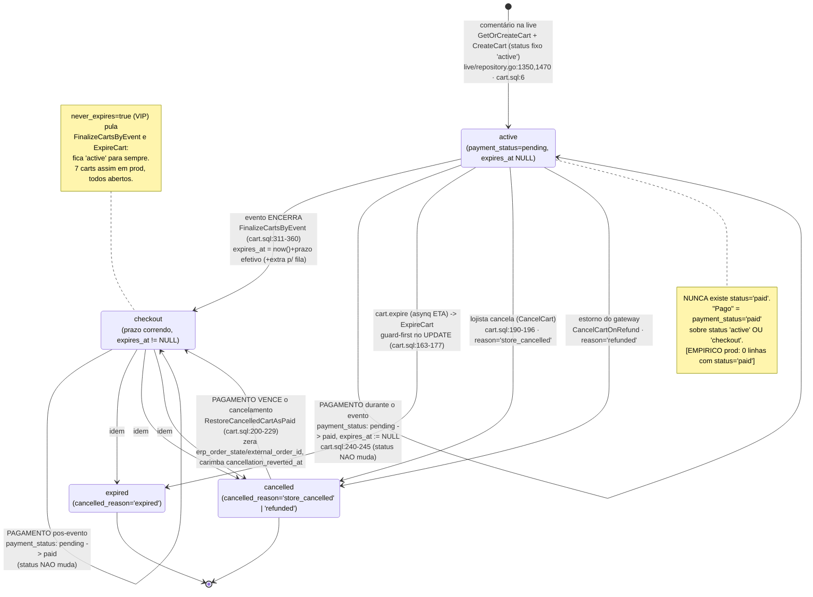
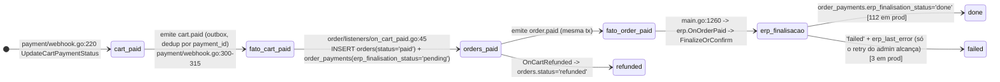
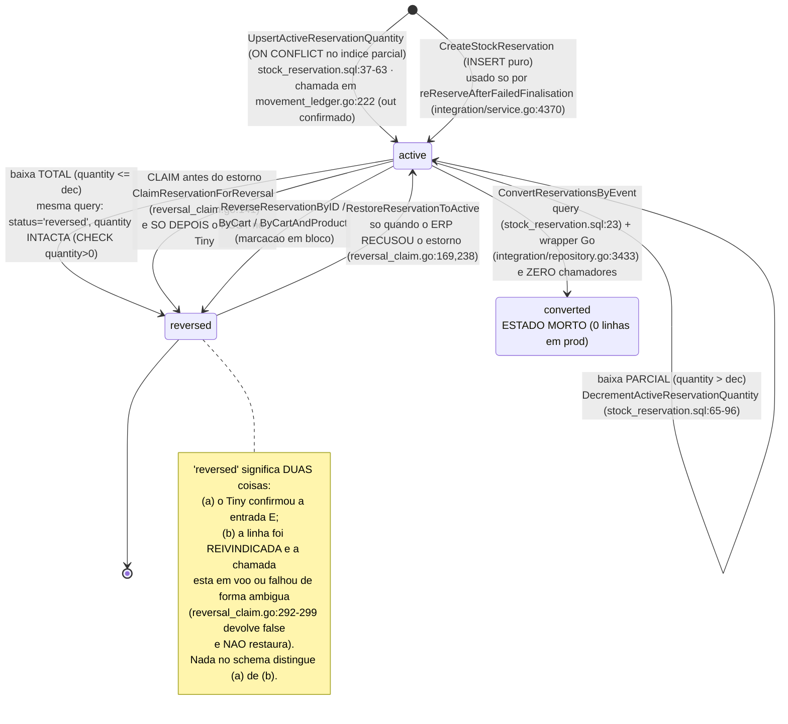

# AUDIT — a integração Tiny/Olist do LiveCart como ela é hoje

Fase 0 (descoberta). **Nenhum código de produção foi alterado na redação deste documento.**
Base: branch `docs/tiny-v3-fase0`, working tree em `c7d4ced`; cliente único
`apps/api/internal/integration/providers/erp/tiny.go` (3.088 linhas).

## Convenção de procedência — vale para cada afirmação abaixo

| Marca | Significa |
|---|---|
| `[EMPÍRICO 25/08]` | medido **hoje** contra a conta real (ADABYTE LTDA, `59.573.950/0001-58`) com `apps/tiny-lab` |
| `[EMPÍRICO 11/07]` | bateria de sandbox de 11/07/2026, mesma conta — teste citado (T2, T6…) |
| `[EMPÍRICO prod]` | lido por mim no Postgres de produção, nos logs, ou transcrito de corpo real em comentário de código |
| `[SWAGGER]` | **o arquivo afirma.** Não é prova de comportamento do ERP |
| `[CÓDIGO arq:linha]` | o que o Go faz, sem juízo sobre estar certo. Toda linha citada foi conferida por mim |
| `[ANÁLISE]` | inferência minha — sempre com a base em que se apoia |
| `[ABERTO]` | não sabemos, e digo qual chamada responderia |

Regra que este documento respeita sem exceção: **`[SWAGGER]` nunca é apresentado como comportamento
comprovado.** Onde a fonte é só o arquivo e o comportamento importa, está escrito qual teste falta.

Swagger de referência: `/mnt/c/Users/aliss/Downloads/swagger.json` — `Olist ERP API v3`, `info.version 3.1`,
127 paths / 202 operações / 348 schemas, `servers[0] = https://api.tiny.com.br/public-api/v3`.

---

# 1. Sumário executivo

## 1.1 O que roda hoje, em uma página

O LiveCart **não usa nenhum mecanismo de reserva do Tiny**. Ele reserva estoque emitindo um
**lançamento manual de saída** — `POST /estoque/{idProduto}` com `tipo:"S"` `[CÓDIGO tiny.go:2224]` — que
**baixa o saldo físico do produto** no ERP do lojista. Quando o pagamento entra, o sistema faz o caminho
inverso: uma **entrada manual** por linha de reserva (`tipo:"E"`, `[CÓDIGO tiny.go:2272]`), e só então cria
o Pedido de Venda (`POST /pedidos`) com `lancar-estoque` inline, que baixa o estoque de novo — agora pela
via oficial.

A descrição informal *"comentário cria reserva; pagamento estorna as reservas e cria o pedido"* está
**correta**, e é literalmente o que roda em produção.

Três camadas de estado convivem, e nenhuma delas é a mesma coisa
`[CÓDIGO + EMPÍRICO prod, \d das três tabelas]`:

| Camada | Tabela | Papel |
|---|---|---|
| Carrinho | `carts` (`status`, `payment_status`) | rascunho do pedido; **nunca** tem `status='paid'` |
| Pedido selado | `orders` + `order_payments` | nasce só depois do `cart.paid`; carrega o estado da finalização no ERP |
| Reserva no ERP | `stock_reservations` (agregado) + `erp_stock_movements` (razão de intenções) | duas contabilidades paralelas do mesmo fato |

## 1.2 O fato mais contraintuitivo do repositório

**Existe um segundo desenho completo — o "Design C", pedido-como-reserva — implementado, testado, varrido
por um ticker de 5 minutos, e que NUNCA executou uma única vez em produção.**

- O ciclo `none → converting → open ⇄ mutating → confirmed/cancelled` vive em
  `internal/erp/order_lifecycle.go` (702 linhas) e é gateado por `OrderAtCheckoutEnabled(storeID)`
  `[CÓDIGO internal/integration/erp_order_delegation.go:118-120]`, que lê a env
  `ERP_ORDER_AT_CHECKOUT_STORE_IDS` `[CÓDIGO internal/integration/service.go:529]`.
- `[EMPÍRICO prod]` **essa variável não existe** — nem em `production` nem em `staging` (Railway MCP,
  `list-variables`). O mesmo vale para `ERP_FINALISE_INVERTED_STORE_IDS` `[CÓDIGO service.go:528]`.
- `[EMPÍRICO prod, 25/08 18h UTC]`:
  ```
  SELECT erp_order_state, count(*) FROM carts GROUP BY 1;
   none | 308      ← 308 de 308
  ```

Consequência prática: **o `PUT /pedidos/{id}/itens` e o ciclo `estornar → PUT /itens → lançar` que aparecem
no código pertencem a esse segundo desenho e estão desligados.** Quem planejar a refatoração assumindo que
o pedido mutável "já está no ar" vai errar o alvo. A decisão é binária e antecede tudo: **ligar e validar,
ou remover** — **903 linhas de produção dedicadas** (`erp/order_lifecycle.go` 702 + `erp_order_delegation.go` 201)
`[CÓDIGO: wc -l]`, mais um sweep de 5 min contra dados que não existem e uma coluna com CHECK de 6 valores que só
tem 1.

## 1.3 O que mudou hoje, e que muda o dimensionamento de tudo

`[EMPÍRICO 25/08]` **O rate limit do Tiny foi medido pela primeira vez.** São **dois baldes independentes**,
e a evidência crua está em `scratchpad/ratelimit-burst.json` (45 requisições concorrentes + 12 sequenciais):

| balde | limite | janela | como o 429 se identifica |
|---|---|---|---|
| rajada | **4** requisições | 1 s | `X-Ratelimit-Limit: 4`, `X-Ratelimit-Reset: 1` |
| sustentado | **30** requisições | 60 s | `X-Ratelimit-Limit: 30`, `X-Ratelimit-Reset: 58→0` |

Sustentado = **0,5 req/s de média**. **Não existe header `Retry-After`** — o único sinal de recuperação é
`X-Ratelimit-Reset` (segundos restantes). Os headers vêm em **toda** resposta, inclusive 200 e 403.
`[SWAGGER]` o arquivo não menciona rate limit em lugar nenhum (busca por `429`, `RateLimit`, `Retry-After`
= 0 ocorrências).

**Aritmética de escala:** uma live de 3 h tem orçamento total de **~5.400 chamadas para TUDO**. Com ~600
compradoras × ~3 itens, um `PUT /pedidos/{id}/itens` por item adicionado consome mais da metade do
orçamento sozinho. **Nenhum desenho alvo cabe nessa cota sem coalescing (debounce por carrinho).**

Notícia boa dentro disso: `[EMPÍRICO 25/08]` o header **`X-Ratelimit-Remaining` existe e vem preenchido**
(`"27"`, `"26"`, `"29"`… nas 200; `"0"` nas 429). Era exatamente o header que o `AdaptiveLimiter` espera
`[CÓDIGO internal/integration/providers/base.go:149]`. **O limitador pode passar a funcionar de verdade** —
depois de corrigido para modelar dois baldes em vez de um (risco #10).

## 1.4 O estado de saúde, em números de produção

`[EMPÍRICO prod, 25/08]`

- **430 reservas ativas = 646 unidades seguradas no Tiny agora**, espalhadas por **168 produtos**.
- **639 dessas 646 unidades estão em carrinhos NÃO pagos.** 166 unidades estão presas desde 16–18/08.
- **3 finalizações de carrinho pago falharam** e continuam falhas: `#1186`, `#1087`, `#1115`. *(O RECON §1 lista
  "duas linhas do razão não resolvidas" — é outro recorte, não outro número: §5.2 e §5.3 abaixo separam os dois.)*
- **2 linhas do razão nunca resolveram**: uma `pending` desde 24/08 19:43 (`#1171`) e uma `unconfirmed`
  desde 25/08 13:52 (`#1115`). Nenhum processo automático alcança nenhuma das duas.
- Razão total: `out/confirmed` 587 (830 un.), `in/confirmed` 477 (686 un.), `in/pending` 1, `in/unconfirmed` 1.

## 1.5 Os quatro problemas estruturais

1. **A cota do ERP é ~0,5 req/s e o fluxo atual gasta N+6..11 chamadas sequenciais por pedido pago**, dentro
   de um deadline de 90 s, com o próprio sistema gerando webhooks que consomem mais cota (auto-DDoS).
2. **O razão de movimentos cobre só metade dos movimentos** — toda edição de checkout e toda saída de fila
   falam com o Tiny **sem registro de intenção** `[CÓDIGO internal/erp/stock_service.go:257-519]`.
3. **`unconfirmed` é um beco sem saída que trava carrinho pago.** A assimetria que criava isso em todo
   estorno foi **corrigida hoje** (`8e633f0`) — mas as duas linhas já travadas continuam travadas.
4. **Reservar = baixar saldo físico** converte prazo de carrinho em estoque indisponível para todos os
   outros canais do lojista, e o carrinho VIP nunca libera.

---

# 2. Inventário de chamadas ao Tiny

Base URL em `[CÓDIGO tiny.go:28]` (`var tinyAPIBaseURL` — `var` só para o teste apontar para `httptest`).

| # | Método + endpoint | Função Go | arquivo:linha | Call sites | Quando dispara | Sync/Async |
|---|---|---|---|---|---|---|
| 1 | `GET /info` | `Tiny.TestConnection` | tiny.go:215-276 (URL 217) | `integration/service.go:780`, `:1909`, `:2051` ← `handler.go:375` | lojista clica "Testar conexão" | **síncrono** (request do painel) |
| 2 | `GET /produtos?limit&nome\|codigo\|gtin&situacao` | `Tiny.ListProducts` | tiny.go:279-398 (URL 280) | `integration/service.go:2966` (2-3 goroutines paralelas de `SearchProducts`); `tiny.go:116` (sem chamador) | busca de produto na tela de importação | **síncrono**, 2-3 simultâneas |
| 3 | `GET /produtos/{id}` | `Tiny.GetProduct` | tiny.go:574-701 (URL 575) | `service.go:3074`, `:3227`, `:3275` (1 **por variação**), `:3384`, `:3523`, `:3693` | busca, import, sync manual, **webhook `estoque`/`produto`**, resync em massa | síncrono na busca; **goroutine desanexada** em `webhook_handler.go:680`; worker asynq no resync |
| 4 | `GET /estoque/{idProduto}` (saldo **físico**) | `Tiny.GetProductStock` | tiny.go:417-433 (URL 418) | `erp/reconciliation.go:98` | lojista roda a reconciliação | **síncrono**, 1 por produto ligado, **sem throttle próprio** |
| 5 | `GET /estoque/{idProduto}` (saldo **disponível**) | `Tiny.saldoDisponivel` | tiny.go:435-528 (URL 436) | interno: `tiny.go:618` (pai), `:642` (**cada variação**), só com `use_available_stock` | todo `GetProduct` da loja com a flag | **multiplica as chamadas por 1+N variações** |
| 6 | `PUT /produtos/{id}` | `Tiny.SyncProduct` | tiny.go:1086-1127 | **nenhum** | — | **código morto** |
| 7 | `POST /pedidos` | `Tiny.CreateOrder` | tiny.go:1140-1507 (URL 1141, envio 1398) | `integration/service.go:5196` ← `finalisation.go:218` (legado), `finalisation.go:327` (invertido, desligado), `order_lifecycle.go:297` (Design C, desligado) | pós-pagamento | **async** — asynq `order.paid` (teto 90 s) |
| 7b | `POST /pedidos` (**reenvio** sem `formaEnvio`) | idem | tiny.go:1433 | interno, quando `isFormaEnvioRejection(body)` | recusa em `transportador.formaEnvio.id` | idem — **2º POST no mesmo fluxo** |
| 8 | `GET /pedidos?marcadores=lc-cart-<id>` | `Tiny.FindOrderIDByMarker` | tiny.go:2182-2203 (URL 2183) | `tiny.go:1935` (adoção no 409), `order_lifecycle.go:210` (sweep), `:529` | recuperação de pedido órfão | async (sweep 5 min) |
| 9 | `POST /pedidos/{id}/marcadores` | `Tiny.AddOrderMarker` | tiny.go:2167-2177 | `tiny.go:1482` (**best-effort** dentro do `CreateOrder`), `order_lifecycle.go:318` | logo após criar o pedido | async |
| 10 | `PUT /pedidos/{id}/situacao {situacao:3}` | `Tiny.ApproveOrder` | tiny.go:2020-2043 | `tiny.go:1494` (**best-effort**), `tiny.go:1950` | fecha a venda | async |
| 11 | `PUT /pedidos/{id}/situacao {situacao:N}` | `Tiny.SetOrderSituacao` | tiny.go:2153-2163 | `order_lifecycle.go:126` (refund→2), `:614` (confirm→3), `:675` (cancel→2) | **só Design C — desligado** | async |
| 12 | `PUT /situacao {2}` + estorno | `Tiny.CancelOrder` | tiny.go:2047-2077 | **nenhum** | — | **código morto** |
| 13 | `POST /pedidos/{id}/lancar-estoque` | `Tiny.LaunchOrderStock` | tiny.go:1966-1995 | `service.go:5219`; `finalisation.go:249`, `:270`, `:355`, `:366`; `order_lifecycle.go:343`, `:353`, `:472` | baixa definitiva | async |
| 14 | `POST /pedidos/{id}/estornar-estoque` | `Tiny.ReverseOrderStock` | tiny.go:1999-2016 | `order_lifecycle.go:129`, `:464`, `:680` (todos Design C); `tiny.go:2049` (morto) | devolução do saldo do pedido | async |
| 15 | `PUT /pedidos/{id}/itens` | `Tiny.UpdateOrderItems` | tiny.go:2085-2110 | `order_lifecycle.go:467` | **só Design C — desligado** | async |
| 16 | `PUT /pedidos/{id}` (`pagamento.parcelas`) | `Tiny.UpdateOrderPayment` | tiny.go:2116-2147 | `order_lifecycle.go:608` | **só Design C — desligado** | async |
| 17 | `GET /pedidos/{id}` | `Tiny.GetInvoiceByOrder` | tiny.go:2579-2628 | `erp/invoice.go:118` | busca de NFe pelo pedido | síncrono (botão) + async (webhook) |
| 18 | `GET /notafiscal/{id}` ⚠️ | `Tiny.GetInvoiceByID` | tiny.go:2632-2657 (**URL 2636**) | `erp/invoice.go:116` | webhook `nota_fiscal` | goroutine em `webhook_handler.go:732` |
| 19 | `GET /notafiscal/{id}/xml` ⚠️ | `Tiny.GetInvoiceXML` | tiny.go:2661-2686 (**URL 2665**) | **nenhum** | — | **código morto** |
| 20 | `POST /estoque/{idProduto}` `tipo:"S"` | `Tiny.ReserveStock` | tiny.go:2224-2268 (**URL 2225**) | `erp/movement_ledger.go:183` (modo razão); `erp/stock_service.go:173`, `:192`, `:400`; `integration/service.go:4381` | **live**: comentário vira item (`live/comment.go:980`); checkout (`checkout/service.go:1247`, `:1487`); promoção de fila (`inventory/service.go:619`) | **misto** — no modo razão é `go s.executeStockMovement(context.Background(), …)` `[stock_service.go:166]`; no caminho `Adjust…` é **síncrono dentro do handler HTTP** |
| 21 | `POST /estoque/{idProduto}` `tipo:"E"` | `Tiny.ReverseStockReservation` | tiny.go:2272-2302 (**URL 2273**) | `erp/reversal_claim.go:122` (ponto único autorizado), `:167` (legado), `erp/stock_service.go:214`, `:480`, `:492` | expiração, pós-pagamento, redução de quantidade, cliente bloqueado, compensação de falha de DB | async (reactors) **e** síncrono (checkout DELETE/PATCH) |
| 22 | `GET /contatos?nome=&cpfCnpj=&limit=10` | `Tiny.SearchContacts` | tiny.go:2313-2357 (URL 2322) | `integration/service.go:5278` (só quando há CPF) | montagem do pedido | async |
| 23 | `POST /contatos` | `Tiny.CreateContact` | tiny.go:2361-2425 | `integration/service.go:5303` | montagem do pedido, CPF não bateu | async |
| 24 | `PUT /contatos/{id}` | `Tiny.UpdateContact` | tiny.go:2498-2540 | `integration/service.go:5333` | enriquecimento do contato | async, **erro engolido** |
| 25 | `GET /formas-pagamento?nome=&situacao=1` | `Tiny.lookupFormaPagamentoID` | tiny.go:1595-1650 (URL 1610) | **só** `HealthCheck` (`tiny.go:2875`, `:2882`) — **não** é chamado na criação do pedido | auditoria de cadastros | síncrono (banner do painel) |
| 26 | `GET /formas-recebimento?limit=100&offset=` | `Tiny.lookupFormaRecebimentoID` | tiny.go:1742-1825 (URL 1751) | `tiny.go:1317` (`CreateOrder`), `HealthCheck` `:2889`, `:2896` | montagem da parcela | **até 5 páginas por pedido** |
| 27 | `GET /formas-envio?nome=&limit=10` | `Tiny.lookupFormaEnvioID` | tiny.go:1834-1880 (URL 1838) | `tiny.go:1226` **e** `:1228` (**2 chamadas** no fallback "SmartEnvios"), `HealthCheck` `:2904`, `:2911`, `:2918` | montagem do `transportador` | async + síncrono |
| 28 | `POST accounts.tiny.com.br/.../token` (`refresh_token`) | `Tiny.RefreshToken` | tiny.go:124-212 (const 44, request 154) | `integration/service.go:6312` ← `createProviderFromRow:6265` | **toda construção de provider** com `creds.IsExpired()` | síncrono, **client próprio, sem rate limiter** (`tiny.go:160`) |
| 29 | `POST .../token` (`authorization_code`) | `Service.HandleTinyOAuthCallback` | integration/service.go:1249 (URL hardcoded em `:1248`) | rota `GET /integrations/oauth/tiny/callback` | conexão inicial da loja | síncrono |
| 30 | `GET .../openid-connect/auth` | `Service.getTinyOAuthURL` | integration/service.go:909-941 (URL hardcoded em `:933`, `state := storeID` em `:930`) | `GetOAuthURL` (`service.go:804`) ← rota do painel | lojista clica "Conectar Tiny" | síncrono |

**Notas estruturais:**

- `[CÓDIGO tiny.go:43]` `tinyAuthURL` está declarado e **nunca é usado** — a URL é duplicada literal em
  `service.go:933`. `tinyTokenURL` (`tiny.go:44`) tem outra cópia em `service.go:1248`.
- **Custo por pedido pago (caminho de produção):** `N` estornos (`POST /estoque` E) + 1-2 contato +
  1-2 `GET /formas-envio` + **1 a 5** `GET /formas-recebimento` + `POST /pedidos` + `POST /marcadores` +
  `PUT /situacao` + `POST /lancar-estoque` ≈ **N + 6 a N + 11 chamadas sequenciais**, todas dentro do teto
  de 90 s do `order.paid` `[CÓDIGO internal/events/types.go:272-275]`.
- **Auto-DDoS por webhook:** `[EMPÍRICO 11/07, report-run-0711-150654.md]` cada `POST /estoque` nosso
  dispara um webhook `tipo:"estoque"` do Tiny, que o `HandleTiny` responde com `GET /produtos/{id}`
  (+ `GET /estoque/{id}` se `use_available_stock`). **O estorno de N reservas gera ≥N leituras extras na
  mesma janela em que a finalização precisa de cota.**
- `[EMPÍRICO 25/08]` O OAuth de produção **não usa PKCE**; a mesma conta autoriza com PKCE S256 sem
  problema (o `tiny-lab` fez), então PKCE é adotável sem custo do lado do fornecedor. Token: **4 h**,
  scope `openid email offline_access`, `aud: tiny-api`.

**Permissões observadas na conta autorizada** `[EMPÍRICO 25/08]` — todas GET:

```
200  /info            200  /produtos?limit=1     200  /contatos?limit=1
200  /pedidos?limit=1 200  /estoque/357281337    200  /formas-pagamento
200  /contas-receber?limit=1
403  /depositos
403  /estoque/357281337/logs-movimentacao
```

Os dois 403 **não são falta de permissão do app**: o JWT carrega 48 roles em `resource_access.tiny-api`,
incluindo `depositos-leitura` e `estoque-leitura`. **O bloqueio é de conta/plano.** Portanto esta conta
**não pode** responder (a) `possuiReserva` nem (b) o shape de `logs-movimentacao` — as duas perguntas de
maior alavancagem da Fase 1. `[ABERTO]` fechar exige `GET /depositos` e
`GET /estoque/{id}/logs-movimentacao` numa conta com o plano certo (produção, em janela combinada, ou uma
conta de teste com o mesmo plano).

---

# 3. Máquina de estados real

## 3.1 Ciclo do carrinho

Estados reais `[EMPÍRICO prod, 25/08 18h UTC]`:

```
carts.status:          active 149 · checkout 91 · cancelled 53 · expired 15
carts.payment_status:  pending 193 · paid 113 · refunded 2
carts.erp_order_state: none 308  (de 308)
orders.status:         paid 113 · refunded 2
order_payments.erp_finalisation_status: done 112 · failed 3
```

**Não existe `carts.status='paid'`** e **não existe `'pending'`** em produção — apesar de `'pending'` ser o
DEFAULT da coluna e de a migration `000032` documentar `paid` como estado válido. O pagamento mexe **só** em
`payment_status`. **Não há CHECK constraint em `carts.status` nem em `carts.payment_status`**
`[EMPÍRICO prod, \d carts]` — a máquina do carrinho não é imposta pelo banco em lugar nenhum; só
`erp_order_state` tem CHECK.



O **pedido** propriamente dito é uma tabela separada e só nasce depois do pagamento:



**Divergência "deveria ser × é":** a migration `000069` criou o ciclo de finalização **no carrinho**; a
`000101` dropou essas 9 colunas e as moveu para `order_payments`. Mas `external_order_id` (id do pedido no
Tiny) **ficou nas duas tabelas** — `carts.external_order_id` e `order_payments.external_order_id`: **duas
moradas para o mesmo id.**

## 3.2 Ciclo da reserva

CHECK real `[EMPÍRICO prod, \d stock_reservations]`, idêntico à migration `000030`:
`CHECK (status IN ('active','reversed','converted'))`.



`[EMPÍRICO prod, 25/08]` `active 430 · reversed 834 · converted 0`. As 430 ativas somam **646 unidades**
em **168 produtos**.

E a máquina **paralela** do razão — CHECK real `[EMPÍRICO prod, \d erp_stock_movements]`:
`CHECK (status IN ('pending','confirmed','failed','unconfirmed','resolving'))`.

```mermaid
stateDiagram-v2
    direction TB
    [*] --> pending : CreateERPStockMovement grava a INTENCAO antes do POST<br/>erp/stock_service.go:150 (out) · erp/reversal_claim.go:224 (in)
    pending --> confirmed : ERP devolveu idLancamento<br/>movement_ledger.go:211 -> UpsertActiveReservationQuantity (so p/ direction='out')
    pending --> failed : errors.Is(err, providers.ErrProvenUndelivered)<br/>movement_ledger.go:191-196
    pending --> unconfirmed : QUALQUER outro erro (timeout, 5xx, corpo ilegivel)
    failed --> resolving : ClaimERPStockMovement (CAS)<br/>retry agendado: 30s / 2min / 10min, teto 5 tentativas
    resolving --> confirmed
    resolving --> failed
    resolving --> unconfirmed
    pending --> resolving : linha envelhecida (>2min) = processo morreu
    resolving --> unconfirmed : "process died mid-call; outcome unknown"<br/>movement_ledger.go:327
    unconfirmed --> confirmed : DECISAO HUMANA landed=true<br/>movement_resolution.go:103 (+ aplica o agregado)
    unconfirmed --> failed : DECISAO HUMANA landed=false (zera attempts)<br/>movement_resolution.go:90
    confirmed --> [*]

    note right of unconfirmed
      Trava a finalizacao do carrinho pago
      (ResolveCartMovementsBeforeFinalisation,
       movement_ledger.go:382 -> finalisation.go:130).
      NAO ha sweep global: so o gate do pagamento
      e o painel manual chegam nela.
    end note
```



`[EMPÍRICO prod, 25/08]` desde 19/08: `out/confirmed 587` (830 un.), `in/confirmed 477` (686 un.),
`in/pending 1`, `in/unconfirmed 1`.

**Vocabulário canônico que o razão ainda não fala:** `[CÓDIGO internal/erp/stock_reservation.go:21-33]` o
código já tem **10 operações de negócio** nomeadas (`StockOp`) — mais o sentinela `StockOpUnspecified` em `:19`,
que não é operação e sim "deixa o sinal do delta decidir": `cart_add`, `qty_increase`, `qty_decrease`,
`waitlist_promote`, `cart_expiry`, `cancel_blocked`, `cart_cancelled`, `cancel_reverted`, `waitlist_cancel`,
`waitlist_expire`. O razão grava apenas `direction ∈ {out, in}` `[CÓDIGO migration 000132:31]`. **Qualquer razão novo tem que cobrir essas
10, não "entrada e saída".**

## 3.3 A sequência de hoje, passo a passo — do comentário ao pedido

### FASE A — comentário vira item + reserva

| # | O que acontece | Onde |
|---|---|---|
| A1 | Webhook do Instagram entra; comentário parseado e deduplicado por `platform_comment_id` | `live/comment.go:126` `ProcessInstagramComment` |
| A2 | Resolve produtos/quantidades do texto; um item por produto | `live/comment.go:479` → `:775` |
| A3 | Split disponível × fila: `availableQty = min(quantidade, product.Stock)`; o resto vira fila | `live/comment.go:840-849` |
| A4 | **Baixa estoque LOCAL** `products.stock -= availableQty` (atômico, `WHERE stock >= $2`) e `erp_seq += 1` | `live/comment.go:860` → `product.sql:55-60` |
| A5 | `AddToCart` → `GetOrCreateCart` (tx + `FOR UPDATE`; cria com `status='active'`, `expires_at` **NULL**) | `live/service.go:1596` → `live/repository.go:1350` → `cart.sql:5-8` |
| A6 | `UpsertCartItem` (`ON CONFLICT (cart_id, product_id) DO UPDATE quantity += …`) | `live/repository.go:1613,1638` → `cart.sql:261-272` |
| A7 | Emite `stock.reserved` (op `cart_add`) com o `cart_id` real — `NoteReserved` | `live/comment.go:933-935` |
| A8 | Cria a linha em `waitlist_items` (se houve parcela em fila) | `live/comment.go:944` |
| A9 | **`ReserveStockInERP`** | `live/comment.go:980` → `erp/stock_service.go:91` |
| A10 | Checa `erp_order_state`; ≠ `none`/`cancelled` desviaria para o Design C. **Em prod é sempre `none`** | `erp/stock_service.go:104-110` |
| A11 | Resolve `external_id` do produto; **não linkado ⇒ no-op silencioso** | `erp/stock_service.go:118-124` |
| A12 | **Grava a intenção** em `erp_stock_movements` (`direction='out'`, `status='pending'`, `idempotency_key` UUID) | `erp/stock_service.go:150` |
| A13 | **Dispara goroutine desanexada** `go s.executeStockMovement(context.Background(), …)` e **retorna nil imediatamente** | `erp/stock_service.go:166` |
| A14 | Na goroutine: `POST /estoque/{ext}` `tipo:"S"`, contexto próprio de 90 s, `observacoes = "@handle - Cart #short_id"` | `erp/movement_ledger.go:170-186` → `tiny.go:2224` |
| A15 | Sucesso ⇒ `status='confirmed'` **e só então** `UpsertActiveReservationQuantity` cria/soma a linha `active` | `erp/movement_ledger.go:211-234` |
| A16 | `ErrProvenUndelivered` (discagem ou 4xx) ⇒ `failed` + retry agendado (30 s / 2 min / 10 min, teto 5) | `erp/movement_ledger.go:239-254` |
| A17 | Qualquer outro erro (timeout, 5xx) ⇒ `unconfirmed`, **sem retry, para sempre** | `erp/movement_ledger.go:256-267` |

### FASE B — evento encerra

| # | O que acontece | Onde |
|---|---|---|
| B1 | `FinalizeCartsByEvent`: `active → checkout`, `expires_at = now() + prazo` (curto ou estendido, + extra de fila) | `cart.sql:311-360` |
| B2 | Pago não transiciona (`payment_status IS DISTINCT FROM 'paid'`); VIP (`never_expires`) não transiciona | `cart.sql:358-359` |
| B3 | Arma `cart.expire` (asynq ETA) por carrinho | `integration/service.go:5400-5417` |
| B4 | **Nada acontece no Tiny.** As reservas seguem `active` por todo o prazo — **7 dias** no ramo estendido (`close_cart_on_event_end = FALSE`, default 10.080 min, migration `000106:69`) | — |

### FASE C — comprador (ou lojista) edita no checkout

| # | O que acontece | Onde |
|---|---|---|
| C1 | PATCH quantidade → trava otimista `SetCartItemSplitIfUnchanged`; 409 se mudou | `checkout/service.go:1211-1245` |
| C2 | `AdjustStockReservationDelta`: **1º muta `products.stock` local**, depois fala com o Tiny | `checkout/service.go:1247` → `erp/stock_service.go:257-276` |
| C3 | `delta>0`: `UpsertActiveReservationQuantity` **antes** do POST; se o ERP recusar, `DecrementActiveReservationQuantity` compensa e `rollbackLocal()` | `erp/stock_service.go:387-415` |
| C4 | `delta<0`: `DecrementActiveReservationQuantity` **antes** do POST; se o ERP recusar, `RestoreReservationQuantityByID` compensa | `erp/stock_service.go:456-510` |
| C5 | **Nenhuma linha em `erp_stock_movements`** — este caminho não passa pelo razão | ausência de `s.movements` em `erp/stock_service.go:257-519` |

### FASE D — pagamento

| # | O que acontece | Onde |
|---|---|---|
| D1 | Webhook do gateway → `UpdateCartPaymentStatus` (guard: recusa se `status IN ('expired','cancelled')`) | `payment/webhook.go:220` → `cart.sql:231-247` |
| D2 | Se recusado por cancelamento do lojista ⇒ `RestoreCancelledCartAsPaid` (**pagamento vence**), zerando `erp_order_state`/`external_order_id` | `payment/webhook.go:229-247` → `cart.sql:200-229` |
| D3 | Emite `cart.paid` no outbox, dedup por `payment_id` | `payment/webhook.go:296-315` |
| D4 | Reactor `cart.paid` → **INSERT em `orders`** + `order_items` + `order_payments`, e emite `order.paid` na MESMA tx | `order/listeners/on_cart_paid.go:45,70` |
| D5 | Reactor `order.paid` → `erp.OnOrderPaid` | `cmd/http-server/main.go:1260` → `erp/reactors.go:42` |
| D6 | `FinalizeOrConfirm` tenta `ConfirmERPOrderPayment`; estado é `none` ⇒ `ErrCartNotConverted` | `erp/reactors.go:23` → `erp/order_lifecycle.go:510-511` |
| D7 | Cai em **`FinalizeCartERPOrder`** (legado — o caminho de produção) | `erp/reactors.go:29` → `erp/finalisation.go:46` |

### FASE E — finalização legada no Tiny

| # | O que acontece | Onde |
|---|---|---|
| E1 | `[L]` Advisory lock por `cart_id` (mata webhooks duplicados) | `erp/finalisation.go:56` |
| E2 | Idempotência dura: `order_payments.erp_finalisation_status == 'done'` ⇒ sai | `erp/finalisation.go:70` |
| E3 | `[S1]` snapshot do pagamento + `attempts++` **antes** de tocar o ERP | `erp/finalisation.go:100-116` |
| E4 | **`[GATE]`** `ResolveCartMovementsBeforeFinalisation`: se sobrar movimento `pending/failed/unconfirmed/resolving` deste cart, **aborta e marca `failed`** | `erp/finalisation.go:130` → `erp/movement_ledger.go:382-407` |
| E5 | `[S0]` Se `carts.external_order_id != ''` ⇒ **RESUME**: `lancar-estoque` (tolerante a "já lançado") e, na falha, fallback reverse-first | `erp/finalisation.go:144` → `:243-305` |
| E6 | `[flag OFF]` `FinalisationInverted(storeID)` é `false` em prod ⇒ **não** entra no launch-first | `erp/finalisation.go:150` |
| E7 | `[S2]` para cada reserva ativa: **claim** (`ClaimReservationForReversal`) → `CreateERPStockMovement(direction='in')` → `POST /estoque` `tipo:"E"` → `MarkERPStockMovementConfirmed` | `erp/finalisation.go:159-208` → `erp/reversal_claim.go:129-190,212-299` |
| E8 | Se **qualquer** estorno não resolveu ⇒ `MarkFinalisationFailed` + erro (asynq retenta) | `erp/finalisation.go:197-208` |
| E9 | `[S3]` `CreateFinalERPOrder(…, launchStock=true)` → `POST /pedidos` **+** `lancar-estoque` inline; grava `carts.external_order_id` | `erp/finalisation.go:218` → `integration/erp_order_delegation.go:143` → `tiny.go:1140` |
| E10 | Falhou o create ⇒ **`ReReserveAfterFailedFinalisation`**: refaz as saídas `S` no Tiny e recria as linhas locais com `CreateStockReservation` (INSERT puro) | `erp/finalisation.go:220` → `integration/service.go:4370-4418` |
| E11 | `[S4]` `MarkCartERPFinalisationDone` → `erp_finalisation_status='done'` + emite `erp.order_finalized` | `erp/finalisation.go:226-234` |

---

# 4. Onde as reservas vazam

"Vazar" = a unidade fica presa (fora do Tiny, ou dobrada nele) sem nenhum processo automático que a
alcance. Ordenado por gravidade.

## V1 — Estorno ambíguo: `unconfirmed` nunca virou `failed` (**CORRIGIDO hoje**)

`[CÓDIGO erp/movement_ledger.go:191-196]` `movementStatusForError` só devolve `MovementFailed` quando
`errors.Is(err, providers.ErrProvenUndelivered)`. Até hoje:

- `Tiny.ReserveStock` (saída) usa `postComRetryDeDiscagem` e **junta o sentinela** em falha de discagem
  **e em 4xx** `[CÓDIGO tiny.go:2233-2257]`;
- `Tiny.ReverseStockReservation` (entrada) usava `DoRequest` cru e **nunca** juntava.

Portanto **todo erro de estorno caía em `unconfirmed`**, que por desenho não re-tenta e trava a
finalização. Os blocos `reversal_claim.go:282-290` ("reversal provably undelivered — retry scheduled") e o
ramo `MovementFailed` do resolver para `direction='in'` eram **inalcançáveis com o provider Tiny**.

**Fica inconsistente:** Tiny com 1 unidade a menos que o real; LiveCart jurando que devolveu (a reserva já
está `reversed`, e o claim **não** é desfeito — `[CÓDIGO reversal_claim.go:292-299]`); e o carrinho pago
bloqueado pelo gate E4.

**Estado:** corrigido em `8e633f0` (branch `fix/erp-estorno-429-provado-nao-aplicado`, já em origin,
**ainda não em `stg` nem em `main`**). Ver risco #3.

## V2 — `ReserveStockInERP` é fire-and-forget e o chamador nunca sabe

`[CÓDIGO erp/stock_service.go:166]` `go s.executeStockMovement(logger.WithStore(context.Background(), …), …)`
seguido de `return nil`. O razão está **sempre** ligado em produção — `SetStockMovementLedger` é chamado
incondicionalmente em `[CÓDIGO integration/service.go:190]`, dentro de `erpStock()`, que por sua vez é aquecido
eagerly em `[CÓDIGO integration/service.go:545]` (a revisão corrigiu aqui um `:539`, que é a atribuição de
`invertFinalisationStoreIDs`, não o wiring do razão). Logo:

- o bloco legado síncrono `erp/stock_service.go:170-233` é **código morto em produção**;
- o `log.Warn("failed to reserve stock in ERP")` em `[CÓDIGO live/comment.go:980-989]` **nunca dispara** —
  a função sempre retorna nil;
- `context.Background()` significa que **um deploy/SIGTERM no meio de uma live mata a chamada em voo** e
  deixa a linha `pending` órfã.

`[EMPÍRICO prod]` a linha `98d4d0e5-6ec5-4ce1-bf21-100a52e2c28c` está `pending` **desde 24/08 19:43**, com
`attempts=0` e `last_attempt_at` NULL.

## V3 — Não existe varredura global do razão: o índice parcial não tem leitor

A migration `000132` criou
`idx_erp_stock_movements_unresolved ON (created_at) WHERE status IN ('pending','failed','unconfirmed','resolving')`
para "o resolver varrer só o que não está resolvido". A query `ListUnresolvedERPStockMovements` existe em
`db/queries/erp_stock_movement.sql:47-53` e é gerada pelo sqlc — **e não tem nenhum chamador Go**
`[CÓDIGO: grep no repo; a única ocorrência fora do `db/sqlc` gerado é o fake de teste
`erp/movement_resolution_test.go:24`, que usa a variante `ByStore`]`.

Os três únicos caminhos que alcançam uma pendência:
1. o **gate da finalização**, por cart, e só se o cart for pago (`erp/movement_ledger.go:386`);
2. o **painel manual** por loja (`erp/movement_resolution.go:53`);
3. o **retry agendado** de um movimento específico, só armado a partir de `failed`.

**Consequência:** um movimento pendente/ambíguo num carrinho que nunca será pago (expira, é cancelado, é
VIP eterno) fica **invisível para sempre** — não trava nada, não alerta nada, e a unidade nunca é conciliada.

## V4 — Edições de checkout e saídas de fila estão FORA do razão

`[CÓDIGO erp/stock_service.go:257-519]` — **`AdjustStockReservationDelta` não grava intenção nenhuma.**
`[CÓDIGO: grep]` `s.movements` não aparece em nenhuma linha do método. Ele fala com o Tiny **síncrono, dentro do
handler HTTP**, e portanto esses movimentos são **invisíveis ao gate da finalização**
(`ResolveCartMovementsBeforeFinalisation`, `erp/movement_ledger.go:382`), que só olha `erp_stock_movements`
daquele cart.

**Call sites diretos (5):**

| Caminho | arquivo:linha | `StockOp` |
|---|---|---|
| PATCH quantidade no checkout | `checkout/service.go:1247` | `qty_increase` / `qty_decrease` |
| Remover item do checkout | `checkout/service.go:1337` | `qty_decrease` |
| Adicionar item no checkout | `checkout/service.go:1487` | `cart_add` |
| Sair da fila | `inventory/service.go:240` | `waitlist_cancel` |
| Expirar da fila | `inventory/service.go:709` | `waitlist_expire` |

**E um sexto ponto de entrada que os relatórios anteriores não tinham mapeado — o do LOJISTA:**
`[CÓDIGO internal/order/item_edit.go:177,186,195]` (*"Edição dos itens de um pedido AGUARDANDO PAGAMENTO,
pelo painel do lojista"*) delega para `AddCartItemAsMerchant` / `SetCartItemQuantityAsMerchant` /
`RemoveCartItemAsMerchant` `[CÓDIGO checkout/service.go:1620,1631,1642]`, que caem **nos mesmos três call
sites** do checkout. Ou seja: o buraco do razão inclui o caminho do painel — o mais difícil de reproduzir
e o mais visível quando quebra.

**Cenários de vazamento:**

- **Processo morre entre `UpsertActiveReservationQuantity` e o POST (delta>0):** banco diz que reservou,
  Tiny nunca soube. Reserva **fantasma** — no estorno do pagamento devolvemos ao Tiny uma unidade que nunca
  saiu de lá. `[ANÁLISE, apoiada em `stock_reservation.sql:65-96` e no incidente do Gabinete Gamer de
  12/08 transcrito em `erp/stock_service.go:437-455`]` — direção "unidade a mais no ERP", a cara.
- **Processo morre entre `DecrementActiveReservationQuantity` e o POST (delta<0):** banco diz livre, Tiny
  diz reservado. Unidade presa **para sempre**; nenhuma varredura a enxerga (a reserva já saiu de `active`
  e não há linha no razão).
- **`rollbackLocal()` falha** `[CÓDIGO erp/stock_service.go:284-303]`: apenas `log.Error`, sem compensação.

## V5 — Carrinho pago com finalização falha: re-reserva presa indefinidamente, fora do razão

`[CÓDIGO integration/service.go:4370-4418]` `reReserveAfterFailedFinalisation` recria as saídas `S` no Tiny
e as linhas locais para um carrinho **já pago**, chamando `provider.ReserveStock` direto e
`CreateStockReservation` (**INSERT puro**, que colide com `uq_stock_reservations_active` se já houver linha
ativa do mesmo `(cart, produto, evento)`). **Não passa pelo razão.**

`[EMPÍRICO prod, 25/08]` é o único vazamento sobre carrinho pago hoje: **5 reservas ativas, 7 unidades,
todas do cart `short_id=1186`**, criadas 23/08 23:11 — depois do `paid_at` 23:10:42.

## V6 — Falha entre o CLAIM e a resposta do ERP, no estorno

`reverseAndCollect` marca a reserva `reversed` **antes** de chamar o Tiny
`[CÓDIGO erp/reversal_claim.go:141]`, por desenho — para o retry não duplicar a entrada (incidente de 08/08,
transcrito em `reversal_claim.go:11-15`: *"o extrato do Tiny ficou com duas entradas de 2 unidades para o
mesmo movimento. Um produto com 5 unidades terminou com 7"*). O preço é assumido explicitamente:

- **Erro ambíguo:** a linha fica `reversed` e a chamada **não é repetida**
  `[CÓDIGO reversal_claim.go:292-299]`. Unidade fora do Tiny.
- **Erro no `CreateERPStockMovement`:** tenta `RestoreReservationToActive`; se **isso** também falhar, só
  resta o log `Error("could not record reversal intent NOR restore the claim — unit stuck out of the ERP")`
  `[CÓDIGO reversal_claim.go:239]`.
- **Processo morre depois do claim, antes do POST:** linha `reversed` + movimento `pending` órfão. Nenhuma
  varredura vê a reserva (filtra `active`) e nenhuma vê o movimento (V3).

Contrato quebrado no caminho: `RestoreReservationToActive` promete no comentário desfazer "só o que ESTA
execução reivindicou (status ainda `reversed` **e sem movimento gravado**)", mas o SQL é
`WHERE id = @id AND status = 'reversed'` — **sem checagem de `erp_movement_id`**
`[CÓDIGO db/queries/stock_reservation.sql, fim do arquivo]`.

## V7 — Live encerrada com sacola aberta, e o carrinho VIP eterno

Encerrar o evento **não toca o Tiny**: `FinalizeCartsByEvent` só arma o prazo (`cart.sql:311-360`). As
reservas seguem `active` por todo o prazo. O **prazo estendido** — o ramo `close_cart_on_event_end = FALSE` — tem
default **10.080 min = 7 dias** (`stores.cart_extended_expiration_minutes`, migration `000106:69`); o ramo ligado
usa `cart_expiration_minutes`, com piso de 15 min e 1440 min para quem tinha 0 (`000106:30-40`).

Para o VIP o vazamento é **estrutural**:
- `FinalizeCartsByEvent` exclui (`AND NOT c.never_expires`, `cart.sql:359`);
- `ExpireCart` exclui (`AND NOT never_expires`, `cart.sql:168`);
- `ActivateEternalCartsForHandle` **anula `expires_at`** dos carrinhos abertos ao promover alguém a VIP
  (`cart.sql:26-31`).

**As reservas de um carrinho VIP nunca são estornadas por tempo.** Só se ele for pago ou cancelado à mão.

## V8 — Expiração/cancelamento com o ERP indisponível marca `reversed` local mesmo assim

`[CÓDIGO erp/finalisation.go:453-543]` `reverseCartReservationsInERP`: quando **não há integração Tiny ativa**
(`GetActiveByProvider` falha — o que inclui token expirado e integração marcada `error`), o código chama
`ReverseReservationsByCart` e marca **todas** as reservas `reversed` em bloco, com um `Warn`
(`finalisation.go:520-531`). As saídas continuam no Tiny e o banco passa a jurar que devolveu.

## V9 — Restauração do item removido perde a parcela em fila

`[CÓDIGO checkout/service.go:1343]` no rollback de falha do ERP, `RemoveCartItem` recria a linha com
`CreateCartItem(ctx, cart.ID, item.ProductID, item.Quantity, item.UnitPrice)` — **sem
`waitlisted_quantity` e sem `session_id`**. Um item com `quantity=3, waitlisted=2` volta como
`quantity=3, waitlisted=0`: **2 unidades fantasma no carrinho** e a atribuição por sessão perdida.

## V10 — Estados que existem no schema e ninguém escreve nem lê

`[EMPÍRICO prod]`
- `stock_reservations.status='converted'` — **0 linhas**; query (`stock_reservation.sql:23`) e wrapper Go
  (`integration/repository.go:3433`) sem chamador. Se alguém a usar: `ListActiveReservationsByCart` filtra
  `= 'active'` e **o estorno nunca alcançaria essas linhas**.
- `carts.status='paid'` — documentado na migration `000032`, **nunca escrito**.
- `carts.payment_status='failed'` / `'cancelled'` — escritos por `payment/webhook.go:196,199`, **0 linhas**.
- `carts.erp_order_state ≠ 'none'` — **0 linhas** (§1.2).

---

# 5. Diagnóstico de produção

Todos os números desta seção foram lidos por mim no Postgres de produção em **25/08/2026, ~18h UTC**
(`roundhouse.proxy.rlwy.net:51128/railway`, somente `SELECT`).

## 5.1 O razão de movimentos

| direction | status | linhas | unidades | mais antigo | mais recente |
|---|---|---|---|---|---|
| `in` | `confirmed` | 477 | 686 | 19/08 19:13 | 25/08 17:53 |
| `in` | `pending` | **1** | 1 | 24/08 19:43 | — |
| `in` | `unconfirmed` | **1** | 1 | 25/08 13:52 | — |
| `out` | `confirmed` | 587 | 830 | 19/08 18:25 | 25/08 17:37 |

Nenhuma linha `failed` e nenhuma `resolving`. **Isso não é sinal de saúde** — é consequência de V1 (o
estorno nunca podia ser classificado `failed`) somada a V4 (metade dos movimentos nunca entra no razão).
`[ANÁLISE]` os 1.064 `confirmed` provam que o caminho feliz funciona; não provam cobertura.

## 5.2 As duas linhas não resolvidas

```
id           | dir | status      | qty | att | criado          | cart | cart_status | pay  | erro
98d4d0e5…    | in  | pending     |  1  |  0  | 24/08 19:43 UTC | 1171 | checkout    | paid | (vazio — nunca tentou)
a62cf364…    | in  | unconfirmed |  1  |  1  | 25/08 13:52 UTC | 1115 | checkout    | paid | reverse stock reservation failed: status 429, message:
```

Precisão importante, que só apareceu ao cruzar com `order_payments`:

- **`#1115` está de fato travado.** `erp_finalisation_status='failed'`, 3 tentativas, `external_order_id`
  gravado (`847982356`), e o último erro é o **próprio gate**: *"cart 141c113f… has 1 unresolved ERP stock
  movement(s): [unconfirmed …] — finalisation blocked to avoid a double stock decrement"*. É o caso
  canônico de V1: um **429** — a recusa mais claramente *provada não-aplicada* que existe — arquivado como
  "não sei se chegou".
- **`#1171` NÃO está travado na finalização**: `erp_finalisation_status='done'`, 1 tentativa,
  `external_order_id=847952177`, concluído 24/08 19:44:17, 39 s depois de a intenção ser gravada. O que
  ficou para trás foi **a linha do razão**, `pending` e órfã. `[ANÁLISE, apoiada em
  `reversal_claim.go:261-266`]` o padrão bate com o caso B13 catalogado: *a entrada `E` foi confirmada no
  Tiny e a gravação no razão falhou → `Error` e retorna `true`* — a finalização segue, a linha nunca fecha,
  e **V3 garante que ninguém volta nela**. É um vazamento de *observabilidade*, não de estoque; mas é
  exatamente o tipo de linha que o gate de um próximo carrinho não vai saber interpretar.

## 5.3 As três finalizações falhas

| cart | pago em | `external_order_id` | tent. | erro |
|---|---|---|---|---|
| **1186** | 23/08 23:10 | `847911430` | 4 | `relançamento de estoque do pedido 847911430 falhou: launch stock failed: status 400 — Não é possível integrar o estoque deste pedido pois o saldo em estoque de um ou mais produtos é insuficien…` |
| **1087** | 25/08 12:15 | **(vazio)** | 3 | `creating ERP order: create order failed: status 429` |
| **1115** | 25/08 13:50 | `847982356` | 3 | `…has 1 unresolved ERP stock movement(s): [unconfirmed …] — finalisation blocked` |

Três causas distintas, e **duas delas são rate limit**:
- 1186 = o deadlock do resume (re-reserva nossa segurando o saldo que o próprio pedido precisa baixar);
  já tem correção em produção (`e8c798d`, PR #53, deploy 24/08 18:23 UTC) — **esta linha é anterior ao
  deploy**.
- 1087 = **429 no `POST /pedidos`**, sem `external_order_id` gravado. `[ANÁLISE]` o pedido pode ter nascido
  no Tiny e ficado órfão: `CreateOrder` grava o id só depois do retorno, e um 429 **não** é retentado neste
  endpoint (risco #2). `[ABERTO]` só um `GET /pedidos?marcadores=lc-cart-<id>` na conta da loja diz se
  existe pedido órfão — é a chamada de recuperação que o sweep faria se o Design C estivesse ligado.
- 1115 = 429 no estorno → `unconfirmed` → gate.

## 5.4 Reservas ativas: 646 unidades seguradas no ERP agora

Por estado do carrinho:

| cart_status | payment_status | VIP | reservas | unidades | mais antiga |
|---|---|---|---|---|---|
| `active` | `pending` | não | 269 | 416 | 23/08 |
| `checkout` | `pending` | não | 119 | 170 | 16/08 |
| `checkout` | `pending` | **sim** | 26 | 35 | **16/08** |
| `active` | `pending` | **sim** | 11 | 18 | 23/08 |
| `active` | **`paid`** | não | 5 | 7 | 23/08 |
| **total** | | | **430** | **646** | |

- **639 das 646 unidades estão em carrinhos NÃO pagos.** As 7 restantes são o `#1186` (V5).
- **166 unidades estão presas desde 16–18/08** — 9 dias.
- **311 das 430 reservas pertencem a carrinhos com `expires_at IS NULL`**, ou seja, **sem prazo armado**.
  Delas: 274 (423 un.) estão num evento ainda `active` que só termina em **29/08**, e 37 (53 un.) são de
  carrinhos VIP — 26 delas num evento **já encerrado em 22/08**.
- **Zero** reservas ativas em carrinhos `expired` ou `cancelled` — o caminho de expiração/cancelamento está
  devolvendo corretamente.
- Espalhamento: **168 produtos distintos** com reserva ativa. Se a fórmula da reconciliação estiver errada
  (risco #13), o relatório de divergência é ruído em todos os 168.

## 5.5 Carrinhos VIP

`[EMPÍRICO prod]` **7 carrinhos `never_expires`, todos abertos** (`active`/`checkout`), segurando **53
unidades**. Nenhum caminho automático libera essas reservas.

---

# 6. Retry, idempotência e rate limit hoje

## 6.1 Retry — quantas chamadas têm, e quais

`[CÓDIGO: grep no `tiny.go`, reconferido na revisão]` **28 pontos de chamada HTTP saem do `tiny.go`**: 24 via
`t.DoRequest(` e 4 via `t.DoRequestWithRetry(` (linhas 1616, 1754, 1841, 2184).

| Camada | arquivo:linha | Política | O que retenta | Cobertura |
|---|---|---|---|---|
| `DoRequestWithRetry` | `providers/base.go:160-234` | backoff `100ms << (n-1)`, teto 5 s; `maxRetries=2` | **5xx e 429** (429 espera `X-RateLimit-Reset` → `Retry-After` → default 60 s, `base.go:191-218`). **Não** retenta 4xx (`base.go:221`) | **4 de 28**: `tiny.go:1616` (formas-pagamento), `:1754` (formas-recebimento), `:1841` (formas-envio), `:2184` (busca por marcador) |
| `postComRetryDeDiscagem` | `tiny.go:3034-3060` | 3 tentativas, esperas 1 s / 3 s | **só** falha de discagem (DNS, ECONNREFUSED, EHOSTUNREACH, ENETUNREACH — `tiny.go:3067-3088`). **Timeout está explicitamente fora** | 1 endpoint (`ReserveStock`); **2 após `8e633f0`** (`ReverseStockReservation`) |
| `saldoDisponivel` | `tiny.go:447-475` | 4 tentativas, 1.200 ms (ou `X-RateLimit-Reset` se ≤ 2 s) | apenas 429 | 1 endpoint |
| `ProcessProductWebhook` | `integration/service.go:3618-3647` | 3 tentativas, backoff `1<<(n-1)` s | erro de sync **e** leitura obsoleta | webhook de produto |
| `resyncOneProduct` | `integration/service.go:6106-6131` | `tentativa²` s | **só** `ErrRateLimited` | resync em massa |
| Razão de movimentos | `erp/movement_ledger.go:131-140` | 30 s → 2 min → 10 min, teto 5 | **só** `MovementFailed` (prova de não-entrega) | `POST /estoque` |
| asynq | `events/types.go:255-259` | `MaxRetry` 3 (fast/normal), 1 (batch) | qualquer erro do reactor | fluxo inteiro |

**O buraco:** `ReserveStock`, `ReverseStockReservation`, `LaunchOrderStock` e `CreateOrder` — **os quatro
endpoints do caminho crítico do dinheiro** — **não têm nenhum tratamento de 429.** Caem no
`!IsSuccessStatus` e viram erro genérico (`tiny.go:2243`, `:2291`, `1966-1995`, `1398-1425`). Os dois
carrinhos travados de 25/08 (`#1087` e `#1115`) morreram exatamente aí.

## 6.2 Idempotência — quais chaves existem e onde viajam

| Chave | Valor | Onde viaja | Serve para |
|---|---|---|---|
| `numeroOrdemCompra` | `"lc-cart-" + cartID` | corpo do `POST /pedidos` (`tiny.go:1177`) | vínculo pedido↔cart que **sobrevive** no Tiny. `[SWAGGER]` **não é filtro de busca** — `GET /pedidos` não tem esse parâmetro |
| `marcadores` | `"lc-cart-" + cartID` | `POST /pedidos/{id}/marcadores` (`tiny.go:2169`) | **é** filtro de busca; âncora de recuperação no 409 e no sweep. `[EMPÍRICO 11/07, T8]` a forma escalar `?marcadores=` funciona; `?marcadores[]=` devolve **500 `{"mensagem":"Internal Server Error"}`** em 30/30 — é erro de sintaxe do servidor, não índice vazio. O "~300 ms de read-after-write" no comentário de `tiny.go:2180` é **má leitura do `dur_ms`**: o POST foi às 18:04:08 e a primeira busca boa às 18:06:00, 112 s depois. A propagação real é DESCONHECIDA, e `FindOrderIDByMarker` usa `maxRetries=2` a ~100 ms — insuficiente se a propagação for de segundos. Um `""` nesse caminho faz o 409 continuar sendo falha e trava o carrinho pago |
| `ecommerce.numeroPedidoEcommerce` | `cartID` | corpo do `POST /pedidos` (`tiny.go:1170-1172`) | **inútil hoje** — `[EMPÍRICO 11/07, T8]` "NÃO gravado" em conta sem canal e-commerce |
| `idempotency_key` do razão | UUID gerado pelo banco | texto de `observacoes` do `POST /estoque` **só no estorno** (`reversal_claim.go:248`) e nos retries (`movement_ledger.go:361`) | desempate **humano** pelo extrato do Tiny |
| `observacoes` da reserva (caminho feliz) | `"@handle - Cart #1189"` (`movement_ledger.go:157-162`) | `POST /estoque` tipo S | **não carrega a chave** — o commit `c7d4ced` trocou os UUIDs pelo `#short_id` para o lojista ler |
| índice único no DB | `uq_stock_reservations_active (cart, produto, evento) WHERE status='active'` | — | garante 1 reserva ativa; **o lançamento órfão no Tiny fica de fora dele** |
| advisory lock por cart | `AcquireCartFinalisationLock` (`finalisation.go:56`) | — | single-flight contra redelivery do gateway |
| CAS `carts.erp_order_state` | `none→converting→open⇄mutating→…` (`order_lifecycle.go:22-30`) | — | single-flight da conversão — **inerte, Design C desligado** |
| claim-first da reserva | `ClaimReservationForReversal` **antes** do POST (`reversal_claim.go:141`) | — | impede estorno duplo (incidente 08/08) |

**O que protege de fato** `[EMPÍRICO 11/07]`:
- `lancar-estoque` 2ª vez → **400 `{"mensagem":"Estoque já lançado."}`**, saldo intacto (T2). O código
  trata como sucesso por substring `"já lançado"` (`tiny.go:1981-1986`). **É a única idempotência do lado
  do Tiny que exploramos.**
- `estornar-estoque` 2ª vez → **204**, saldo intacto, não infla (T2).
- `POST /pedidos` repetido → **409 `{"mensagem":"Esse registro já existe"}`** (13 ocorrências na bateria,
  sem id no corpo) — tratado adotando o pedido pelo marcador (`tiny.go:1421-1425`).

**O que NÃO protege** `[EMPÍRICO 11/07, T10 + `erp/tiny_ledger_semantics_test.go:41-52`]`: `POST /estoque`
**não deduplica nada**. Dois corpos byte-idênticos `{"tipo":"E","quantidade":3,…}` → `idLancamento`
`358129445` e `358129482`, saldo `10 → 13 → 16`. **Retry cego sempre duplica.** E o Tiny **aceita saldo
negativo** (lançar sobre saldo 0 → `-1`, sem erro) — embora `[EMPÍRICO prod]` a conta da Canto da Art tenha
**recusado** com 400 "saldo insuficiente" no `#1186`, o que indica que isso também é **configuração de
conta**.

## 6.3 Rate limit — o que existe, e o que agora sabemos

**O que existe no código:**

`AdaptiveLimiter` (`lib/ratelimit/adaptive.go`), um por `integrationID`, chamado em **todo** `DoRequest`
antes do envio `[CÓDIGO providers/base.go:76-80]`. Alimentado em `[CÓDIGO providers/base.go:148-154]`, que
só chama `UpdateFromHeaders` **se `X-RateLimit-Remaining` vier na resposta**. Algoritmo:

- `[CÓDIGO adaptive.go:53-56]` sem dados de header, `hasAPIData=false` → **libera tudo**;
- `[CÓDIGO adaptive.go:59-63]` quando a janela expira, **zera o estado e libera tudo de novo**;
- `[CÓDIGO adaptive.go:76-77]` com dados: `interval = (resetAt − now) / remaining`, espaçamento uniforme.

**O que mudou hoje.** `[EMPÍRICO 25/08]` os headers **existem e vêm preenchidos em toda resposta**:

```json
200 → {"X-Ratelimit-Limit":"30","X-Ratelimit-Remaining":"27","X-Ratelimit-Reset":"17","Retry-After":null}
429 → {"X-Ratelimit-Limit":"4", "X-Ratelimit-Remaining":"0", "X-Ratelimit-Reset":"1", "Retry-After":null}
```

Três consequências diretas:

1. **O `AdaptiveLimiter` pode passar a funcionar de verdade.** A hipótese "o Tiny não manda header, logo o
   limiter é decorativo" **caiu**: ele recebe dados desde a primeira resposta. (Nota técnica: o
   `Header.Get` do Go canonicaliza a chave, então `X-Ratelimit-Remaining` e `X-RateLimit-Remaining` são a
   mesma coisa — **não há bug de caixa**.)
2. **Mas o modelo do limiter está errado por construção**: ele guarda **um** balde e a realidade tem
   **dois**, que se anunciam **nos mesmos nomes de header** com valores incompatíveis (`limit 30 / reset 17`
   numa 200 do sustentado; `limit 4 / reset 1` numa 429 da rajada). Cada resposta **sobrescreve** a
   anterior, e o limiter oscila entre modelar uma janela de 1 s e uma de 60 s. Ver risco #10.
3. **`Retry-After` não existe.** `[CÓDIGO base.go:191-218]` a cascata do `DoRequestWithRetry` é
   `X-RateLimit-Reset` → `Retry-After` → **default 60 s**; na prática só o primeiro ramo vai valer, e ele
   está certo — `X-Ratelimit-Reset` é segundos restantes e a recuperação é automática ao rolar a janela,
   sem bloqueio prolongado.

**O que o swagger diz sobre rate limit:** `[SWAGGER]` **nada.** `"429"` → 0 ocorrências; `RateLimit` → 0;
`Retry-After` → 0. Nenhuma resposta 429 é declarada em nenhum dos 127 paths.

**O que o doc interno diz, e por que não bate:** `[EMPÍRICO: `apps/api/docs/integrations-rate-limiting.md:110-118`]`
Básico/Crescer 60 req/min, Essencial 120, Grande 240. `[EMPÍRICO 25/08]` a medição na conta real deu **30
req/60 s** — metade do menor plano documentado, e com um balde de rajada de 4/s que o documento não
menciona. `[ABERTO]` se o limite varia por plano, o número da Canto da Art pode ser outro; a mesma rajada
controlada na conta dela responderia — e é leitura, portanto segura.

**Comportamentos que o resto do código assume:** `[CÓDIGO tiny.go:31-33]` `estoqueThrottleBackoff = 1200ms`
e o comentário *"o Tiny limita a ~1 req/s"*. `[EMPÍRICO 25/08]` o sustentado é **0,5 req/s** — o código é
**duas vezes mais otimista** que a realidade.

---

# 7. RISCOS ORDENADOS POR SEVERIDADE

Ordem = impacto × probabilidade **real**, não elegância. Todo risco tem arquivo:linha.

---

### #1 · O orçamento de cota do Tiny não comporta o fluxo de uma live — **CRÍTICO**

**arquivo:linha** — `tiny.go:31-33` (backoff calibrado para ~1 req/s); `events/types.go:272-275`
(deadline 90 s); `integration/service.go:5997-6000` (respiro de 2 s a cada 25 produtos).

**O que acontece na prática.** `[EMPÍRICO 25/08]` o teto sustentado é **30 requisições / 60 s = 0,5 req/s**,
com um segundo balde de **4 req/s** para rajada. Uma live de 3 h tem **~5.400 chamadas para tudo**. Hoje o
sistema gasta, por comentário, 1 `POST /estoque`; por pedido pago, `N+6..11` chamadas; e cada `POST /estoque`
nosso **provoca um webhook do Tiny** que o `HandleTiny` responde com mais 1-2 leituras
(`webhook_handler.go:680` → `GET /produtos/{id}` + `GET /estoque/{id}`). Com 600 compradoras × 3 itens o
orçamento estoura antes do fim da live, e o que estoura primeiro é sempre a finalização — porque ela é a
única parte com deadline.

**Evidência.** `[EMPÍRICO 25/08]` `scratchpad/ratelimit-burst.json`, 45 concorrentes + 12 sequenciais.
`[EMPÍRICO prod]` cart `#1087`: `creating ERP order: create order failed: status 429`, 3 tentativas,
25/08 12:15–12:20.

**Correção proposta.** (a) **Coalescing por carrinho** — debounce de N segundos agregando as mutações de um
mesmo cart numa chamada só; (b) limiter configurado por **dois baldes** (risco #10) e **compartilhado entre
réplicas** (hoje é in-process); (c) parar de gastar cota com o eco do próprio webhook — ignorar webhook de
estoque cujo `idProduto` tem movimento nosso confirmado nos últimos X segundos.

**Esforço.** (a) médio-alto (muda o contrato de `ReserveStockInERP`); (b) médio; (c) pequeno.

---

### #2 · Os quatro endpoints do caminho do dinheiro não tratam 429 — **CRÍTICO**

**arquivo:linha** — `tiny.go:2243` (`ReserveStock`), `tiny.go:2291` (`ReverseStockReservation`),
`tiny.go:1966-1995` (`LaunchOrderStock`), `tiny.go:1398-1425` (`CreateOrder`). Retry existe apenas em
`tiny.go:1616`, `:1754`, `:1841`, `:2184` — **4 de 28** pontos de chamada.

**O que acontece na prática.** O 429 cai no `!IsSuccessStatus` e vira `"… failed: status 429"`. Em
`CreateOrder` isso mata a finalização **depois** de a chamada possivelmente ter criado o pedido no Tiny; em
`ReserveStock` vira `failed` no razão (repetível, ok); em `ReverseStockReservation` virava `unconfirmed`
(risco #3).

**Evidência.** `[EMPÍRICO prod]` cart `#1087` (429 no `POST /pedidos`, `external_order_id` vazio) e cart
`#1115` (429 no estorno). Ambos 25/08, ambos ainda falhos.

**Correção proposta.** Rotear os quatro por uma política única de 429 que respeite `X-Ratelimit-Reset`
(agora sabemos que ele existe e é confiável) — para `CreateOrder`, retry **só** com re-checagem por
marcador antes, para não criar pedido duplicado.

**Esforço.** Pequeno para os três de estoque; **médio** para `CreateOrder` (exige o `FindOrderIDByMarker`
antes do retry).

---

### #3 · Estorno recusado virava `unconfirmed` e travava carrinho pago — **CRÍTICO · CORRIGIDO hoje**

**arquivo:linha** — antes: `tiny.go:2272-2302` (`DoRequest` cru, sem sentinela) contra
`tiny.go:2233-2257` (`ReserveStock`, que junta `ErrProvenUndelivered` em discagem **e** em 4xx);
classificador único em `erp/movement_ledger.go:191-196`.

**O que acontecia.** Todo erro de estorno — inclusive um **429**, que é recusa antes de aplicar — era
arquivado como `unconfirmed`. `unconfirmed` **por desenho nunca re-tenta** e trava a finalização pelo gate
`erp/finalisation.go:130`. Resultado: unidade fora do Tiny, reserva marcada `reversed` sem estorno real, e
carrinho pago parado à espera de um humano.

**Evidência.** `[EMPÍRICO prod]` movimento `a62cf364-dbdf-49f4-b1ff-c944384bf8e1`, `direction=in`,
`last_error="reverse stock reservation failed: status 429"`, criado 25/08 13:52; cart `#1115`,
`erp_finalisation_status='failed'`.

**Correção.** **Feita:** commit `8e633f0`, branch `fix/erp-estorno-429-provado-nao-aplicado`, já em origin.
`ReverseStockReservation` passou a usar `postComRetryDeDiscagem`, a juntar `ErrProvenUndelivered` em falha
de discagem e em **todo 4xx**, e a manter **5xx ambíguo de propósito** (o servidor respondeu e pode ter
aplicado antes de quebrar; repetir inflaria o saldo — incidente de 08/08). 5 testes novos em
`internal/integration/providers/erp/estorno_simetria_test.go`.

**Ressalva que continua aberta.** O fix corrige o comportamento **futuro**. **As duas linhas já travadas
(`#1115` unconfirmed e `#1171` pending) continuam travadas** e exigem ação operacional que **ainda não foi
tomada**. O commit também **ainda não está em `stg` nem em `main`**.

**Esforço restante.** Merge + deploy: pequeno. Destrave das duas linhas: manual, pelo painel de resolução
(`erp/movement_resolution.go:53`), depois de conferir o extrato do produto no Tiny.

---

### #4 · O razão é cego a metade dos movimentos, inclusive aos do lojista — **CRÍTICO**

**arquivo:linha** — `erp/stock_service.go:257-519` (`AdjustStockReservationDelta`, sem `s.movements`).
Call sites: `checkout/service.go:1247`, `:1337`, `:1487`; `inventory/service.go:240`, `:709`. Entrada extra
pelo painel: `order/item_edit.go:177,186,195` → `checkout/service.go:1620,1631,1642`.

**O que acontece na prática.** Essas chamadas falam com o Tiny **síncronas, dentro do handler HTTP, sem
registrar intenção**. Um crash entre a mutação local e o POST deixa banco e ERP divergentes **sem nenhuma
linha que registre a dúvida** — e o gate da finalização (`erp/movement_ledger.go:382`), que só lê
`erp_stock_movements`, **aprova o carrinho como se estivesse limpo**.

**Evidência.** `[CÓDIGO: grep]` `s.movements` não aparece em nenhuma linha do método.
`[EMPÍRICO prod, transcrito em `erp/stock_service.go:437-455`]` incidente de 12/08: *"um PATCH (2→1) e um
DELETE do mesmo item se cruzaram por 83 ms… o Gabinete Gamer fechou o dia com uma unidade a mais no Tiny do
que existia de verdade."* **O razão nunca observou nenhum dos incidentes reais que motivaram a
refatoração** — o que significa que os 1.064 movimentos `confirmed` em produção medem cobertura, não saúde.

**Correção proposta.** Fazer `AdjustStockReservationDelta` passar pelo mesmo razão, com a `StockOp` já
existente (`erp/stock_reservation.go:19-33`) gravada na linha — o razão passa a ter as **10 operações**, e o
gate passa a ver o carrinho inteiro.

**Esforço.** **Alto.** São 5 call sites + 3 métodos `AsMerchant`, e o método hoje é síncrono com rollback
local acoplado — mudar para intenção-primeiro muda o contrato de erro do checkout (o comprador hoje recebe
422 na hora).

---

### #5 · A reserva é fire-and-forget com `context.Background()` — **ALTO**

**arquivo:linha** — `erp/stock_service.go:166`; chamador que perde o erro em `live/comment.go:980-989`.

**O que acontece.** `go s.executeStockMovement(context.Background(), …)` seguido de `return nil`. O
chamador **sempre** vê sucesso; o `log.Warn("failed to reserve stock in ERP")` nunca dispara; e um
SIGTERM/deploy no meio da live **mata a chamada em voo** (contexto desanexado não é cancelado nem
aguardado). O bloco legado síncrono `erp/stock_service.go:170-233` virou código morto por consequência.

**Evidência.** `[EMPÍRICO prod]` linha `98d4d0e5…` em `pending`, `attempts=0`, `last_attempt_at` NULL,
desde 24/08 19:43 — **>24 h**.

**Correção proposta.** Trocar a goroutine solta por um job (asynq já está no caminho de todo o resto), ou no
mínimo por um worker pool com `context` derivado do shutdown, drenado no SIGTERM.

**Esforço.** Médio.

---

### #6 · Não existe varredura global do razão — **ALTO**

**arquivo:linha** — `db/queries/erp_stock_movement.sql:47-53` (`ListUnresolvedERPStockMovements`, gerada e
**sem chamador**); índice `idx_erp_stock_movements_unresolved` da migration `000132`, criado para um
resolver que nunca foi escrito.

**O que acontece.** Só três coisas alcançam uma pendência: o gate da finalização (por cart, e só se pago),
o painel manual (por loja), e o retry agendado (só a partir de `failed`). **Um movimento ambíguo num
carrinho que nunca será pago é invisível para sempre.**

**Evidência.** `[CÓDIGO: grep]` a única ocorrência fora do `db/sqlc` gerado é o fake de teste
`erp/movement_resolution_test.go:24`. `[EMPÍRICO prod]` a linha `pending` de 24/08 é a prova viva.

**Correção proposta.** Um ticker que consuma o índice, com política por status: `failed` → re-executa
(retry já existe); `pending` envelhecido → `resolving` → reclassifica; `unconfirmed` → alerta e, **se
`logs-movimentacao` responder**, resolve sozinho consultando o extrato.

**Esforço.** Pequeno (o ticker) + dependente de `[ABERTO]` para a parte automática.

---

### #7 · 646 unidades presas no ERP, 639 delas em carrinhos não pagos; VIP nunca libera — **ALTO**

**arquivo:linha** — `cart.sql:311-360` (`FinalizeCartsByEvent` só arma prazo, não toca o Tiny);
`cart.sql:359` e `cart.sql:168` (VIP excluído de finalizar e de expirar); `cart.sql:27-32`
(`ActivateEternalCartsForHandle` **anula** `expires_at`); prazo estendido default 10.080 min (migration
`000106`).

**O que acontece.** Como reserva = baixa de saldo físico, cada carrinho aberto retira estoque de **todos os
outros canais do lojista** (loja física, marketplace, e-commerce) pelo tempo do prazo. Para o VIP não há
prazo nenhum.

**Evidência.** `[EMPÍRICO prod, 25/08]` 430 reservas ativas = **646 unidades em 168 produtos**; 639 em
carrinhos não pagos; **166 unidades desde 16–18/08**; 311 reservas em carrinhos **sem `expires_at`**; 7
carrinhos VIP abertos segurando 53 unidades, 26 reservas delas num evento **encerrado em 22/08**.

**Correção proposta.** Curto prazo: um prazo máximo absoluto para reserva no ERP, independente do prazo do
carrinho (ex.: estorna no ERP e mantém o carrinho aberto com `stock` local reservado). Longo prazo: é a
pergunta que o Caminho A responderia — se o Tiny tiver reserva nativa, nada disso baixa saldo.

**Esforço.** Médio (curto prazo) · depende de `[ABERTO]` T-A1/T-A3 (longo prazo).

---

### #8 · Aritmética do deadline: 30 s por chamada × N+6..11 chamadas dentro de 90 s — **ALTO**

**arquivo:linha** — `tiny.go:91` (HTTP client 30 s); `events/types.go:272-275` (asynq `order.paid` 90 s);
`erp/movement_ledger.go:171` e `erp/reversal_claim.go:249` (contextos próprios de 90 s).

**O que acontece.** **Três** chamadas lentas estouram o job. O pior ponto para estourar é **depois** do
`POST /pedidos`: pedido criado no Tiny, `external_order_id` não gravado, marcador não aplicado
(`tiny.go:1482`, best-effort), aprovação não executada (`tiny.go:1494`, best-effort) — o pedido fica órfão e
inencontrável.

**Evidência.** `[EMPÍRICO prod, transcrito em `events/types.go:264-271`]` *"Um pedido de 1 item fecha em
2-3 s; os de 5 e 7 itens estouraram os 15 s no meio… Em 16/08 foram 3 pedidos pagos nesse estado, 2 deles
sem sequer registrar o id de volta."* `[EMPÍRICO prod]` cart `#1087` de 25/08 é o mesmo padrão, agora com
429 no lugar da lentidão.

**Correção proposta.** Quebrar a finalização em passos idempotentes com estado persistido entre eles (o
`external_order_id` gravado **antes** do que vem depois), e gravar o marcador **no próprio POST** se o Tiny
aceitar `marcadores` no corpo — `[ABERTO]` `PedidoModel` declara o campo `[SWAGGER]`, nunca foi enviado.

**Esforço.** Médio-alto.

---

### #9 · Carrinho pago com finalização falha: re-reserva fora do razão, presa indefinidamente — **ALTO**

**arquivo:linha** — `integration/service.go:4370-4418` (`reReserveAfterFailedFinalisation`), chamado em
`erp/finalisation.go:220`. Usa `provider.ReserveStock` direto e `CreateStockReservation` (INSERT puro, que
colide com `uq_stock_reservations_active`).

**O que acontece.** Unidade segurada **para sempre contra dinheiro já recebido**, sem nenhuma linha no
razão que a torne visível, e sem retry automático — só o botão do admin.

**Evidência.** `[EMPÍRICO prod]` cart `#1186`: 5 reservas ativas / 7 unidades criadas 23/08 23:11, depois do
`paid_at` 23:10:42, `erp_finalisation_status='failed'` desde então (4 tentativas).

**Correção proposta.** A re-reserva também passa pelo razão; e a linha `failed` de finalização entra na
varredura global (#6) com alerta.

**Esforço.** Pequeno-médio.

---

### #10 · O `AdaptiveLimiter` modela um balde; a realidade tem dois — **ALTO**

**arquivo:linha** — `lib/ratelimit/adaptive.go:53-56` (sem dados → libera tudo), `:59-63` (janela expirou →
**zera o estado e libera tudo**), `:76-77` (`interval = timeToReset / remaining`), `:129-136`
(`UpdateFromHeaders` guarda **um** par); alimentação em `providers/base.go:148-154`.

**O que acontece na prática.** `[EMPÍRICO 25/08]` os dois baldes se anunciam **nos mesmos nomes de header**:
uma 200 do sustentado diz `limit 30 / remaining 27 / reset 17`; uma 429 da rajada diz
`limit 4 / remaining 0 / reset 1`. Cada resposta **sobrescreve** a anterior, então o limiter alterna entre
modelar uma janela de 1 s e uma de 60 s. Pior: `[CÓDIGO adaptive.go:59-63]` quando a janela rola ele
**apaga o estado e volta a liberar tudo** — exatamente o instante em que N goroutines em espera são
soltas juntas e estouram o balde de rajada (4/s). E o limiter é **in-process por `integrationID`**, enquanto
o limite medido é **por conta** e compartilhado com todos os outros apps do lojista.

**Evidência.** `scratchpad/ratelimit-burst.json` (headers de 57 respostas); `lib/ratelimit/adaptive.go`
lido inteiro.

**Correção proposta.** Substituir por dois token buckets fixos e conhecidos (4/s e 30/60 s), com margem, e
usar os headers só para **corrigir** o estado (não para defini-lo). Se houver mais de uma réplica, o balde
precisa ser compartilhado (Redis — já está no stack).

**Esforço.** Médio. A boa notícia: agora existe medição para calibrar contra.

---

### #11 · O erro do ERP vira só log e o fluxo segue, em 41 pontos mapeados — **ALTO**

**arquivo:linha** — 13 dentro do cliente + 28 nos orquestradores. Os mais caros:

| Onde | O que engole | Consequência |
|---|---|---|
| `tiny.go:1482-1488` | `AddOrderMarker` falha → `Warn`, **`CreateOrder` retorna SUCESSO** | pedido **sem âncora de recuperação**; 2 pedidos pagos perdidos em 16/08 |
| `tiny.go:1493-1500` | `ApproveOrder` falha → `Warn`, sucesso | pedido nasce "Em aberto"; lojista aprova na mão |
| `tiny.go:476-495`, `:503-515` | `saldoDisponivel` falha → **cai no saldo FÍSICO** | reoferta de estoque reservado — incidente `834962410` (22/08) |
| `integration/service.go:6266-6273` | **refresh de token falha → `Warn` e segue com credencial expirada** | toda chamada seguinte falha com 401 sem diagnóstico |
| `integration/service.go:5858-5862` | estorno de cliente bloqueado: **retorno inteiro descartado** | unidade some sem registro |
| `erp/reconciliation.go:99-108` | leitura falha → `Skipped++` | **o produto some do relatório de divergência** |
| `integration/webhook_handler.go:680-718`, `:732-741` | goroutine desanexada; o 200 já foi devolvido ao Tiny | **nenhuma falha de webhook tem retry** |

Os dois últimos têm atenuante honesto: o 200 incondicional é **deliberado e correto**
(`webhook_handler.go:594-595`: *"após 20 respostas não-200 o Tiny remove a URL do webhook"*).

**Evidência.** Lista completa e nominada no relatório `04-audit-chamadas-tiny.md` §5.2 (A1–A13, B1–B28),
cada item com arquivo:linha.

**Correção proposta.** Não é "parar de engolir" — é **ter um catálogo**. Hoje existem só três
discriminadores: status HTTP espalhado por função, **três matchers por substring** (`"já lançado"` em
`tiny.go:1981`, `"formaenvio"` em `tiny.go:1886-1888`, `"insuficiente"` em `order_lifecycle.go:59-61`) e o
sentinela `ErrProvenUndelivered`. Sem catálogo, os 41 pontos viram 41 decisões ad-hoc de novo na refatoração.

**Esforço.** Alto, mas fatiável — começar pelos 7 da tabela.

---

### #12 · A integração de NFe aponta para um path que não existe no contrato — **MÉDIO-ALTO**

**arquivo:linha** — `tiny.go:2636` (`GET /notafiscal/{id}`), `tiny.go:2665` (`GET /notafiscal/{id}/xml`);
consumidor em `erp/invoice.go:116`. E `tiny.go:2601-2607` (`GetInvoiceByOrder`) procura `notaFiscal`,
`notasFiscais` e `ecommerce.notaFiscal` em `GET /pedidos/{id}`.

**O que acontece.** `[SWAGGER]` **não existe nenhum path contendo `notafiscal`** — os paths reais são
`/notas/{idNota}` e `/notas/{idNota}/xml`. E `ObterPedidoModelResponse` tem **só** `idNotaFiscal` (integer),
nenhum dos três campos procurados. `[ANÁLISE]` ambos os caminhos devolvem sempre `ErrInvoiceNotFound`, que
`erp/invoice.go:120-124` engole com `return nil, nil` — **o front mostra "Aguardando NFe" para sempre e
ninguém vê erro**.

**Evidência.** `[SWAGGER]` verificado sobre o arquivo. **Não há evidência empírica**: `[EMPÍRICO 11/07]` a
bateria **nunca emitiu NFe** (`idNotaFiscal` veio `0` em todos os 42 pedidos), então o 404 é inferência.

**Correção proposta.** `[ABERTO]` antes de corrigir, uma chamada a cada path com uma NFe real decide se
`/notafiscal/{id}` ainda funciona por compatibilidade. Rota provável: `GET /pedidos/{id}.idNotaFiscal` →
`GET /notas/{id}`. Conferir também se `ObterNotaFiscalModelResponse` tem os campos que `parseInvoice`
espera — **ninguém abriu esse schema ainda**.

**Esforço.** Pequeno depois do teste.

---

### #13 · A fórmula da reconciliação parece subtrair duas vezes — **MÉDIO**

**arquivo:linha** — `erp/reconciliation.go:112`: `expected := p.LocalStock - p.Held`, com
`Held = SUM(quantity) FILTER (status='active')`. (Relatórios anteriores citaram `:243`; **a linha é 112** —
verificado por mim.)

**O que acontece.** `[ANÁLISE]` no fluxo real **as duas contabilidades já caíram**: o cart-add faz
`products.stock -= n` (`live/comment.go:860`) **e** a saída manual faz o saldo do Tiny cair `n`
(`tiny.go:2224`). Partindo iguais em `S`, após `n` reservas ambos valem `S−n`; logo
`expected = (S−n)−n = S−2n` contra `actual = S−n` ⇒ **divergência falsa de `+Held` em todo produto com
reserva ativa**.

**Evidência.** Bate com o comentário do próprio autor (`integration/service.go:240-243`): *"a fórmula
(LocalStock − Held) ainda precisa de calibração com dados reais — a validação de 18/08 mostrou divergência
não explicada num produto saudável"*. `[EMPÍRICO prod]` a exposição é **168 produtos** com reserva ativa —
se a análise estiver certa, o único detector que temos é ruído em quase todos eles. Agravante: a
reconciliação **não roda em ticker**; é um GET manual (`integration/handler.go:75`) que **só detecta, nunca
corrige**.

**Correção proposta.** `[ABERTO]` **uma** chamada decide: `GET /estoque/{id}` de um produto com N unidades
em reserva ativa — o `saldo` bate com `products.stock` ou com `products.stock − N`?

**Esforço.** Trivial depois da chamada.

---

### #14 · O espelho de estoque repõe a unidade vendida (`erp_ack_seq`) — **MÉDIO**

**arquivo:linha** — `db/queries/product.sql:111-128` (trava otimista por `erp_seq`); leitura do `seen_seq`
em `integration/service.go:3691`; prova commitada e **skipada** em
`internal/integration/defeito_aberto_ack_do_erp_test.go:49` (`t.Skip(defeitoAberto)`).

**O que acontece.** `erp_seq` sobe quando o movimento entra no **nosso** contador; o saldo do Tiny só muda
quando o POST chega **lá** (200–500 ms medidos). Uma leitura de webhook tirada nessa janela descreve o
passado — **e a trava aprova**. O espelho então repõe a unidade vendida.

**Evidência.** Defeito documentado com prova determinística no próprio repo, deliberadamente skipada.

**Correção proposta.** `erp_ack_seq` (o espelho exige `erp_ack_seq = erp_seq`). Está bloqueada porque exige
parear **15 call sites em 5 pacotes**.

**Esforço.** Alto. É dívida antiga, não regressão.

---

### #15 · O Design C é ~900 linhas inertes varridas por um ticker — **MÉDIO**

**arquivo:linha** — `internal/erp/order_lifecycle.go` (702 linhas) gateado por
`integration/erp_order_delegation.go:118-120`; flag lida **uma vez no boot** em
`integration/service.go:529`; sweep `RunERPOrderOpsSweep` num ticker de 5 min
(`cmd/http-server/main.go:747,770`).

**O que acontece.** `MutateERPOrderItems`, `ConfirmERPOrderPayment`, `CancelERPOrderForCart`,
`RefundConvertedCartOrder` e `applyCartGridToOrder` **nunca executaram contra dados reais**. O ticker roda a
cada 5 min consultando um índice parcial que nunca tem linha.

**Evidência.** `[EMPÍRICO prod]` `ERP_ORDER_AT_CHECKOUT_STORE_IDS` **não existe** em production nem em
staging (Railway MCP); `SELECT erp_order_state, count(*) FROM carts` → `none: 308/308`.

**Correção proposta.** Decisão binária **antes** de qualquer refatoração: ligar em uma loja e validar, ou
remover. Manter é o pior dos três — envelhece sem execução e distorce a leitura do código.

**Esforço.** Remover: médio. Ligar e validar: alto (e depende de `[ABERTO]` T-A3).

---

### #16 · O webhook do Tiny não confere de quem é — **MÉDIO**

**arquivo:linha** — `integration/webhook_handler.go:576` (`HandleTiny`), `:583` (resolve a loja **só** pelo
`storeId` da URL), `:592` (`RecordWebhookPing` **antes de qualquer validação**), `:670`
(`SignatureValid: true, // Tiny doesn't use signatures`).

**O que acontece.** Não há HMAC, não há allowlist de IP, e o `cnpj` que vem no corpo do webhook — o único
material de posse disponível — **não está sequer no struct de parse**. Consequências, por probabilidade:
(a) **ping forjável** — `webhookLastPingAt` é hoje o único sinal de que o webhook manual está vivo, e fica
verde com tráfego de qualquer origem: **diagnóstico envenenado no meio de uma live**; (b) troca de conta
Tiny na mesma loja (LIV-85, multi-CNPJ) passaria despercebida.

**Atenuante honesto.** `[CÓDIGO integration/service.go:3591-3615]` `ProcessProductWebhook` resolve a
integração por `storeID+provider` e faz `HasProduct(storeID, externalProductID)` antes de chamar o ERP —
um webhook mal endereçado normalmente **no-op**. O dano de estoque exige colisão de `idProduto` entre
contas; o dano de **sinal** e o de **cota** (cada webhook errado gasta `GET /produtos` + `GET /estoque` do
token da loja errada — e agora sabemos o quanto isso custa, risco #1) são imediatos.

**Correção proposta.** Guardar o `cpfCnpj` do `GET /info` em `integrations.metadata` no momento do OAuth
(`[EMPÍRICO 25/08]` o campo existe e é estável: `59.573.950/0001-58`) e descartar com 200 quando o
`dados.cnpj` do corpo divergir.

**Esforço.** Pequeno.

---

### #17 · OAuth: `state` cru e refresh sem escape — **MÉDIO**

**arquivo:linha** — `integration/service.go:930` (`state := storeID` cru) e `:1196`
(`storeID := input.State`, **sem validação**); `tiny.go:147-152` (`RefreshToken` monta o form com
`fmt.Sprintf`, **sem escape**, enquanto o callback em `service.go:1236` usa `url.Values` "for proper URL
encoding").

**O que acontece.** (a) O `state` é CSRF-able e vaza o UUID da loja na URL do browser — **a tabela
`oauth_states` já existe** (migration `000027`, inclusive com `code_verifier`) e o Melhor Envio já usa o
desenho certo (`melhor_envio_oauth.go:44-82`). (b) Um `client_secret` contendo `+`, `&` ou `=` **corrompe o
refresh**; quando falha, `service.go:6315` marca a integração como `error`.

**Evidência.** `[EMPÍRICO 25/08]` o `tiny-lab` completou `authorization_code` **com PKCE S256** contra a
mesma conta — ou seja, **adotar PKCE não custa nada do lado do fornecedor**.

**Correção proposta.** Migrar o Tiny para o desenho do Melhor Envio (`oauth_states` + PKCE) e trocar o
`fmt.Sprintf` por `url.Values`.

**Esforço.** Pequeno.

---

### #18 · O rollback do "remover item" perde a parcela em fila — **MÉDIO**

**arquivo:linha** — `checkout/service.go:1343`:
`CreateCartItem(ctx, cart.ID, item.ProductID, item.Quantity, item.UnitPrice)` — sem `waitlisted_quantity`,
sem `session_id`.

**O que acontece.** Item com `quantity=3, waitlisted=2` volta como `quantity=3, waitlisted=0`: **2 unidades
fantasma no carrinho** (porque `quantity` é o total e o disponível é `quantity − waitlisted_quantity`) e a
atribuição por sessão perdida. Dispara só quando o ERP recusa a remoção — que é justamente o momento em que
o sistema já está sob estresse.

**Evidência.** `[CÓDIGO]` lido; `[EMPÍRICO]` nenhum caso identificado em produção **porque nada mede isso**.

**Correção proposta.** Recriar com a linha completa (há `CreateCartItemFull` ou equivalente a escrever).

**Esforço.** Pequeno.

---

### #19 · Comentários obsoletos gastam 1 a 5 chamadas por pedido — **MÉDIO** (era baixo antes de #1)

**arquivo:linha** — `tiny.go:1733-1742` (*"o endpoint /formas-recebimento não aceita filtro `nome`, só
limit/offset"* → **pagina até 5 páginas de 100** comparando em memória, **por pedido criado**);
`tiny.go:1643-1649` (*"O parâmetro `nome` não está na doc da v3"*); `tiny.go:530-534` (*"O schema não está
na documentação pública"* — **está**, e documenta exatamente o que o parser adivinhou).

**O que acontece.** `[SWAGGER]` os três endpoints declaram `nome` **e** `situacao`: `/formas-envio` =
`[nome, tipo, situacao, limit, offset]`; `/formas-pagamento` e `/formas-recebimento` =
`[nome, situacao, limit, offset]`. Com cota de 0,5 req/s, gastar até 5 chamadas para achar uma forma de
recebimento é caro em cima do deadline de 90 s.

**Evidência.** `[SWAGGER]` — e **é só isso**. `[ABERTO]` `GET /formas-recebimento?nome=Pix` funciona de
fato? Uma chamada responde, e o ganho é imediato. O `situacao` de `/formas-envio` pode ainda ser o campo
que evita o *"Forma de envio não habilitada"* que matou uma venda paga em 16/08
(`erp/tiny_forma_envio_test.go:1-13`).

**Esforço.** Trivial depois do teste.

---

### #20 · A máquina de estados do carrinho não é imposta pelo banco — **BAIXO**

**arquivo:linha** — `[EMPÍRICO prod, \d carts]` **não há CHECK em `carts.status` nem em
`carts.payment_status`**; só `erp_order_state` tem (`CHECK IN ('none','converting','open','mutating',
'confirmed','cancelled')`, migration `000085`). `orders.status` também **não tem CHECK**.

**O que acontece.** Todo predicado de negócio vive espalhado em `WHERE` replicados em ~15 lugares, sem rede
nenhuma contra estado inválido. Três valores documentados nunca existiram (`carts.status='paid'`,
`payment_status='failed'`/`'cancelled'`), e um valor DEFAULT (`'pending'`) nunca aparece.

**Correção proposta.** CHECK constraints + limpeza dos valores mortos, numa migration.

**Esforço.** Pequeno, mas exige varrer os writers antes.

---

### #21 · Duas funções idênticas produzem o marcador de recuperação — **BAIXO (mas silencioso)**

**arquivo:linha** — `tiny.go:1964` (`tinyCartMarker`) e `erp/order_lifecycle.go:50` (`erpOrderMarker`) —
**duas funções idênticas** que produzem `"lc-cart-" + id`, em pacotes diferentes.

**O que acontece.** Se divergirem, **a adoção de pedido por marcador — o único caminho de recuperação do
409 e do sweep — para de funcionar em silêncio**. Nada testa que as duas concordam.

**Correção proposta.** Uma função, um pacote, e um teste que compara as duas saídas.

**Esforço.** Trivial.

---

### #22 · O CI não roda teste nem build, e aponta para AWS ECS — **BAIXO (mas amplifica todos os outros)**

**arquivo:linha** — `.github/workflows/deploy.yml`, arquivo **único**: "Deploy Backend to AWS ECS",
`on: push branches:[main]` + `workflow_dispatch`,
`paths: ['apps/api/**','go.mod','go.sum','Dockerfile','.github/workflows/deploy.yml']`. **Nenhum job de
`go test`, `go build`, `vet` ou lint em lugar nenhum.**

**O que acontece.** (a) Nada segura um build quebrado antes do merge — a validação local vira obrigatória;
(b) um comando novo sob `apps/api/cmd/` **cai no filtro de paths e dispara o workflow**; um módulo separado
em `apps/<nome>/` (caso do `tiny-lab`) fica fora. `[ABERTO]` confirmar se esse workflow ECS ainda está
vivo, já que a operação real é Railway.

**Registro correlato.** `[EMPÍRICO 25/08]` a suíte `internal/conventions` (`TestNoNewRawHttpxThrows`)
**falha em `stg`** por causa de `customer/vip.go` (feature Clientes VIP). Provado **pré-existente** por
stash — não é regressão desta linha de trabalho, mas com CI ausente ninguém teria notado.

**Esforço.** Pequeno.

---

# 8. Dívida conhecida e código morto

Um veredito por item: **LIGAR** · **CORRIGIR ANTES DE LIGAR** · **REMOVER**.

| Item | arquivo:linha | Estado | Veredito |
|---|---|---|---|
| **Design C inteiro** (`order_lifecycle.go`, 702 ln + sweep) | `erp/order_lifecycle.go`; gate `erp_order_delegation.go:118`; sweep `main.go:770` | Implementado, testado, **0 execuções** (`erp_order_state none 308/308`) | **DECIDIR PRIMEIRO.** Só faz sentido LIGAR se `[ABERTO]` T-A3 mostrar que o pedido do Tiny cria reserva nativa. Caso contrário, **REMOVER** — manter custa um ticker de 5 min e distorce a leitura do repo |
| Finalização invertida (launch-first) | `erp/finalisation.go:150,327`; flag `service.go:528` | Implementada, flag ausente nos dois ambientes | **REMOVER** ou dobrar no Design C. Duas flags nunca ligadas é padrão, não acaso |
| Bloco legado síncrono de reserva | `erp/stock_service.go:170-233` | Inalcançável — o razão está sempre ligado (`service.go:190`, aquecido em `:545`) | **REMOVER**. Enquanto existir, dá a falsa impressão de que há caminho síncrono com compensação |
| `stock_reservations.status='converted'` | query `stock_reservation.sql:23`; wrapper `integration/repository.go:3433` | 0 chamadores, 0 linhas | **REMOVER** (e o valor do CHECK junto). Se um dia for usado, note que `ListActiveReservationsByCart` filtra `='active'` e **o estorno nunca alcançaria essas linhas** |
| `ListUnresolvedERPStockMovements` | `db/queries/erp_stock_movement.sql:47-53` + índice `000132` | Gerada, indexada, **sem chamador** | **LIGAR.** É a peça que falta para fechar V3 — a query e o índice já estão pagos |
| `Tiny.SyncProduct` (`PUT /produtos/{id}`) | `tiny.go:1086-1127` | Sem chamador; devolve `Success:false` com **erro nil** (`:1098-1126`) | **REMOVER**. O formato "sucesso falso com erro nil" é armadilha para o próximo chamador |
| `Tiny.CancelOrder` | `tiny.go:2047-2077` | Sem chamador (substituído por `SetOrderSituacao(2)` + `ReverseOrderStock`) | **REMOVER** |
| `Tiny.GetInvoiceXML` | `tiny.go:2661-2686` | Sem chamador, **e aponta para path inexistente** | **CORRIGIR ANTES DE LIGAR** (risco #12) ou remover junto |
| `Tiny.ValidateCredentials` | `tiny.go:116` | Sem chamador | **REMOVER** |
| `tinyAuthURL` / `tinyTokenURL` | `tiny.go:43`, `:44`; cópias em `service.go:933`, `:1248` | Um declarado e nunca usado; o outro duplicado literal | **CORRIGIR**: uma constante, um lugar |
| `tinyCartMarker` × `erpOrderMarker` | `tiny.go:1964` × `erp/order_lifecycle.go:50` | Duas funções idênticas em pacotes diferentes | **CORRIGIR** — risco #21 |
| `lookupFormaPagamentoID` | `tiny.go:1595-1650`; só `HealthCheck` (`:2875`, `:2882`) | Sobrevive só para a auditoria; `meioPagamento` foi **desativado** na criação do pedido (`tiny.go:1300-1310`) | **CORRIGIR**: a auditoria valida um cadastro que o fluxo real não usa — ou o `HealthCheck` mente para o lojista, ou o `meioPagamento` volta |
| `GetProductStock` × `saldoDisponivel` | `tiny.go:417-433` × `:435-528` | Mesmo endpoint, dois parsers, semânticas **opostas**, sem compartilhar nada | **CORRIGIR**: um parser, dois campos |
| `defeito_aberto_ack_do_erp_test.go` | `:49` (`t.Skip`) | Prova determinística commitada e **desligada** | **CORRIGIR ANTES DE LIGAR** — risco #14. Um teste skipado é dívida com juros |
| `HealthCheck` que sempre passa | `tiny.go:2933-2940` — cada `g.Go` retorna `nil` incondicionalmente | Item vira `unknown` em vez de falha | **CORRIGIR**: auditoria que nunca reprova não é auditoria |
| `paginacao.totalRegistros` | `tiny.go:1773-1775` | `[SWAGGER]` `PaginatedResultModel = {limit, offset, total}` e `totalRegistros` = **0 ocorrências em 1,1 MB**; `[EMPÍRICO 25/08]` os corpos reais de `/pedidos`, `/produtos` e `/formas-pagamento` vieram todos com `"paginacao":{"limit","offset","total"}`. O campo **não existe** e o parser lê sempre 0 | **CORRIGIR** (alimenta só um log Debug, mas é prova de parser escrito por chute) |
| `apps/tiny-lab/` | módulo Go próprio, commit `1b6e51b`, branch `feat/tiny-lab-oauth-recon` | Funciona; guard duplo (`TINY_ENV=sandbox` + `cpfCnpj` do `GET /info` contra `TINY_ALLOWED_CNPJ`), **allowlist vazia ⇒ nenhuma escrita foi feita**; audit em `.tiny-lab/audit.jsonl` | **LIGAR** — é a ferramenta da Fase 1. Primeiro ato: **uma pessoa** decide e escreve o CNPJ autorizado. O `.env` já tem `TINY_CLIENT_SECRET` real; o `.gitignore` aninhado cobre, mas o diretório está untracked |

**Nota de calibração sobre o swagger, que vale para toda a dívida acima.**
`[EMPÍRICO: diff programático entre os schemas de Pedidos e os corpos reais de 11/07]` os schemas de
**RESPOSTA** batem campo a campo com a realidade, sem sobra nem falta. Já os de **REQUEST** não fecham
nada: `additionalProperties` aparece **0 vezes** em 1,1 MB, `readOnly`/`writeOnly`/`deprecated` também 0, e
**45 dos 68 schemas de request distintos não declaram nenhum campo obrigatório em toda a cadeia `allOf`/`$ref`**
(= **65 das 89 operações com corpo**). *(O "51 de 60" que circulava no acervo está errado — recontado
programaticamente na revisão adversarial.)* Regra prática para a Fase 1:
**parsers de resposta podem ser gerados do swagger; validação de request não pode, e cada campo de escrita
precisa de um teste.** Corolário direto: **nada no arquivo sustenta afirmações de imutabilidade** — dizer
que "o frete é imutável porque o `PUT /pedidos/{id}` não declara `valorFrete`" é inferir proibição a partir
de ausência, num documento que nunca fecha o objeto. `[EMPÍRICO 11/07]` o `PUT /pedidos/{id}` foi chamado
**2 vezes na história do projeto**, ambas só com `{"pagamento":{"parcelas":[…]}}`. A hipótese nunca foi
testada — só nunca foi tentada.

---

# Apêndice — o que ficou `[ABERTO]`, e a chamada exata que fecha cada item

Ordenado por alavancagem. Os dois primeiros **não podem ser respondidos pela conta ADABYTE**
(`[EMPÍRICO 25/08]` 403 de conta/plano em `/depositos` e em `/logs-movimentacao`).

| # | Pergunta | Chamada que fecha | O que decide |
|---|---|---|---|
| 1 | A conta tem módulo de reserva nativo? | `GET /depositos` → ler `possuiReserva` (`[SWAGGER]` descrição literal: *"Indica se a conta possui o módulo de reserva de estoque ativo"*; **o mesmo model serve `/depositos` e `/depositos/{id}`**, logo **uma leitura sem parâmetros detecta o regime**). `grep possuiReserva` no repo = **0 ocorrências** | Detector determinístico de Caminho A vs B, por loja, no onboarding — em vez de descobrir por falha silenciosa |
| 2 | Um **pedido** cria reserva nativa, e em que momento? | `POST /pedidos` (situação 0) → `GET /estoque` · `PUT /situacao {3}` → `GET /estoque` · `POST /lancar-estoque` → `GET /estoque` | **A pergunta de maior alavancagem do dossiê.** Se `reservado` subir no POST ou na aprovação, o Design C deixa de ser opcional e vira o caminho certo — e paramos de corromper o saldo físico do lojista |
| 3 | `logs-movimentacao` responde 200, e com o quê? | `POST /estoque/{id} {"tipo":"E","quantidade":1,"precoUnitario":10,"observacoes":"LAB-<uuid>"}` → guardar `idLancamento` → `GET /estoque/{id}/logs-movimentacao?dataInicio=…&dataFim=…&tipo=E&limit=100`, capturar a resposta **crua** | Se `observacao` ecoar fielmente o que enviamos, **a classe `unconfirmed` inteira vira consulta determinística** e o gate que trava carrinho pago some. Ressalva: `[SWAGGER]` a resposta 200 aponta para `PaginatedResultModel` = `{limit, offset, total}` **sem array de itens**, e `LogMovimentacaoEstoqueResponseModel` é **schema órfão** (1 ocorrência em 1,1 MB). Atenção à assimetria: o POST envia `observacoes` (plural), o log declara `observacao` (singular) |
| 4 | O frete/desconto/endereço/itens são mesmo imutáveis após a criação? | `PUT /pedidos/{id}` com `{"valorFrete":15.9}`, depois `{"valorDesconto":5}`, depois `{"enderecoEntrega":{…}}`, depois `{"itens":[…]}` — `GET` após cada um | Decide "pedido mutável" × "cancelar e recriar". **4 chamadas** fecham uma decisão de arquitetura inteira que hoje se apoia só em ausência no swagger |
| 5 | `POST /pedidos` com `situacao:3` nasce aprovado? | `POST /pedidos {…,"situacao":3}` → `GET /pedidos/{id}` + `GET /estoque/{id}` | Elimina uma chamada do caminho crítico (relevante a 0,5 req/s) **e** fecha a janela do 409-sem-aprovação que matou 3 pedidos pagos em 16/08. `[EMPÍRICO 11/07]` `situacao` **nunca foi enviada** nos 42 POSTs da bateria |
| 6 | A fórmula da reconciliação está errada? | `GET /estoque/{id}` de um produto com N unidades em reserva ativa | Risco #13 — decide se o único detector que temos é ruído em 168 produtos |
| 7 | `/formas-recebimento?nome=Pix` funciona? | `GET /formas-recebimento?nome=Pix` | Risco #19 — elimina até 5 chamadas por pedido |
| 8 | O 429 é aplicado ou recusado no `POST /estoque`? | Forçar 429 num `POST /estoque` e confirmar ausência no `logs-movimentacao` (depende de #3) | Valida empiricamente a premissa do fix `8e633f0` (hoje é `[ANÁLISE]` bem fundamentada, não medição) |
| 9 | `/notas/{idNota}` é o path certo, e `/notafiscal/{id}` ainda responde? | Os dois paths com uma NFe real emitida | Risco #12 |
| 10 | Numa conta **multi-depósito**, para onde vai o `POST /estoque` sem `deposito.id`? | `GET /depositos` + um `POST /estoque` **com** e outro **sem** `deposito.id`, lendo `GET /estoque/{id}.depositos[]` | `[EMPÍRICO 11/07]` **toda a base empírica de reserva manual foi feita numa conta mono-depósito** (ADABYTE tem só "Geral"). A Canto da Art tem "galpão (estoque)" e "loja" — **o conhecimento não transfere** |
| 11 | O rate limit varia por plano? | A mesma rajada controlada na conta da Canto da Art (é **leitura**, portanto segura) | Dimensiona o limiter do risco #10 para a loja real |
| 12 | A matriz de transições de `situacao` | Exercitar `0→3, 3→1, 1→2, 2→3, 3→4, 4→7, 7→5, 5→6, 6→0, 3→3` em pedidos descartáveis | `[EMPÍRICO 11/07]` só **2** transições foram exercitadas em toda a história (`{situacao:3}` 4× e `{situacao:2}` 30×, todas 204). **Zero 400 em `/situacao`, jamais** — 88 das 90 células são desconhecidas |

**Bloqueio operacional que precede todos:** `[EMPÍRICO 25/08]` `TINY_ALLOWED_CNPJ` está **vazio** no
`apps/tiny-lab/.env`, e o guard exige `TINY_ENV=sandbox` **mais** o `cpfCnpj` do `GET /info` na allowlist,
conferido a cada execução. **Nenhuma escrita foi feita nesta sessão — só GETs e a troca de token.** O
primeiro ato da Fase 1 é **uma pessoa decidir e escrever qual CNPJ é o autorizado**, não descobrir por
tentativa. E `[EMPÍRICO: README do tiny-lab]` **não existe ambiente de sandbox do lado do Tiny** — host
único `https://api.tiny.com.br/public-api/v3`. Toda escrita da Fase 1 acontece numa conta **real**.

---

## Verificação

> Revisão **adversarial** deste documento e do `RECON.md`, feita em **25/08/2026** por um segundo leitor com acesso
> ao disco. Método: reabrir cada `arquivo:linha` e cada citação de swagger e tentar derrubá-la. O que caiu está
> corrigido **no lugar**. Nenhum código de produção foi alterado.

## O que foi conferido

- **~220 citações `arquivo:linha` distintas**, nos dois documentos, uma a uma com `sed -n 'Np'` / `grep -n` sobre a
  árvore em `c7d4ced`. O **inventário de chamadas de §2 resistiu quase intacto**: todas as 30 linhas de função e
  todas as linhas de URL (`tiny.go:215/217, 279/280, 417/418, 435/436, 574/575, 1086, 1140/1141, 1595, 1610, 1742,
  1751, 1834, 1838, 1966, 1999, 2020, 2047, 2085, 2116, 2153, 2167, 2182/2183, 2224/2225, 2272/2273, 2313/2322,
  2361, 2498, 2579, 2632/2636, 2661/2665, 124/154`) batem exatamente.
- **~35 asserções do swagger**, com `python3` sobre `/mnt/c/Users/aliss/Downloads/swagger.json` — ver a lista
  detalhada em `RECON.md` §Verificação. Todas as que este documento usa (paths de `notafiscal` inexistentes,
  `ObterPedidoModelResponse` com só `idNotaFiscal`, `PaginatedResultModel`, `totalRegistros` = 0 ocorrências,
  filtros de `/formas-*`, `additionalProperties` = 0) **se confirmaram**.
- **Contradições RECON × AUDIT**: cruzamento de datas, contagens, vereditos e dos números de produção.
- **Aritmética interna de §1.4, §5.1, §5.4 e §3.1**, que fecha: `430 = 269+119+26+11+5` · `646 = 416+170+35+18+7` ·
  `639 = 646−7` · `311 = 274+37` · `53 un. VIP = 35+18` · `1.064 confirmed = 477+587` · `308 = 149+91+53+15` =
  `193+113+2` · `115 orders = 113+2 = 112 done + 3 failed`.
- **Markdown**: pipes por linha em cada tabela, cercas ```` ``` ```` balanceadas, âncoras.
- **Português**: varredura por palavra repetida, crase, espaço duplo e typos frequentes — **nenhuma ocorrência**.

## O que foi corrigido neste documento

| # | Onde | Estava | Está |
|---|---|---|---|
| 1 | V2 e §8 (dívida) | `SetStockMovementLedger` chamado em `integration/service.go:539` | **`:190`**, dentro de `erpStock()`, aquecido eagerly em **`:545`**. A linha 539 é `invertFinalisationStoreIDs: invertIDs`. A **afirmação** ("sempre ligado em produção") sobrevive; a citação não sobrevivia |
| 2 | V7 e risco #7 | `cart.sql:169` (VIP fora do `ExpireCart`) | **`:168`** — 169 é `AND expires_at < now()` |
| 3 | V7 e risco #7 | `cart.sql:361` (VIP fora do `FinalizeCartsByEvent`) | **`:359`** — 361 é linha em branco |
| 4 | §3.1 (mermaid), FASE B1, V7, risco #7 | `FinalizeCartsByEvent` = `cart.sql:311-362` | **`311-360`** — 362 é o `-- name:` da query **seguinte** (`ShiftOpenCartExpirations`) |
| 5 | FASE B2 | `cart.sql:357-361` | **`358-359`** (as duas cláusulas citadas) |
| 6 | §3.1 (mermaid) | `cart.sql:238-243` para `UpdateCartPayment` | **`240-245`** (240 é o `UPDATE`, 245 o `RETURNING`) |
| 7 | Risco #16 | `webhook_handler.go:669` = `SignatureValid: true` | **`:670`** — 669 é `Payload: json.RawMessage(body)` |
| 8 | FASE A, passo A7 | `live/comment.go:930` para o `stock.reserved` | **`933-935`** (`NoteReserved`) — 930 é `zap.Bool("new_cart", …)`, campo de log |
| 9 | §1.2 e risco #15 e §8 | `erp_order_delegation.go:116-118` | **`118-120`** — 116/117 são comentário; a função começa em 118 |
| 10 | §3.2 (mermaid, 2×) e V4 | `stock_reservation.sql:37-60` e `:62-96` | **`:37-63`** e **`:65-96`** — a segunda começava dentro do `RETURNING` da primeira |
| 11 | §3.2 | `stock_reservation.go:19-33` = "10 operações" | **`:21-33`**. A linha 19 é `StockOpUnspecified` — sentinela, não operação. As 10 listadas estão certas e completas |
| 12 | §8 (nota de calibração) | *"51 dos 60 request bodies sem `required`"* | **45 dos 68 schemas de request distintos** (= 65 das 89 operações com corpo). O número herdado não reproduz |
| 13 | §1.2 e risco #15 | *"~1.200 linhas"* de Design C | **903 linhas de produção dedicadas** (`order_lifecycle.go` 702 + `erp_order_delegation.go` 201), medidas com `wc -l` |
| 14 | Risco #22 | `paths: [apps/api/**, go.mod, go.sum, Dockerfile]` | O workflow também dispara em `.github/workflows/deploy.yml` e tem `workflow_dispatch` — o que **reforça** a alínea (b) do risco |
| 15 | §2, linha 30 da tabela | **Linha com 6 células numa tabela de 7 colunas** (markdown quebrado) | Completada: `Service.getTinyOAuthURL`, `service.go:909-941` (URL em `:933`, `state := storeID` em `:930`), chamada por `GetOAuthURL` (`:804`) |
| 16 | V3, V4, §6.1, riscos #4 e #6 | `[EMPÍRICO: grep]` | **`[CÓDIGO: grep]`** — resultado de grep no repositório não é medição contra o ERP; a convenção do topo reserva `[EMPÍRICO]` para isso |
| 17 | §1.1 | Tabela das três camadas sem marca de procedência | `[CÓDIGO + EMPÍRICO prod]` |
| 18 | §8 | `paginacao.totalRegistros` sustentado só por `[SWAGGER]` | Somado o lastro `[EMPÍRICO 25/08]`: os corpos reais de `/pedidos`, `/produtos` e `/formas-pagamento` vieram todos com `{limit, offset, total}` |
| 19 | V7 e FASE B4 | *"prazo (default 7 dias)"* | Qualificado: os **7 dias** são o **prazo estendido** (`close_cart_on_event_end = FALSE`, `stores.cart_extended_expiration_minutes`, default 10.080, migration `000106:69`); o ramo ligado usa `cart_expiration_minutes` (piso 15, 1440 para quem tinha 0) |
| 20 | §1.4 | "3 finalizações falharam" lido em conflito com o "dois carrinhos travados" do RECON | Nota de desambiguação; e o **RECON §1 foi reescrito** para carregar a precisão de §5.2 (o **#1171** tem `erp_finalisation_status='done'` — o que ficou parado é a linha do razão) |

**Confirmadas contra tentativa de derrubada** (não mudaram): `reconciliation.go:112` — a correção *"relatórios
anteriores citaram `:243`; a linha é 112"* está **certa**, conferida por mim. `tiny.go:1421-1425` (adoção no 409)
**e** `tiny.go:1935` (`FindOrderIDByMarker` dentro de `adoptExistingOrder`) são as duas corretas, em níveis
diferentes — não há contradição. `base.go:221` é de fato `if resp.StatusCode < 500`. `base.go:160-234` é
exatamente o corpo de `DoRequestWithRetry`. `adaptive.go:53-56 / :59-63 / :76-77 / :129-136` — todas exatas.
`erp_stock_movement.sql:47-53`, `product.sql:55-60` e `:111-128` — exatas. As 8 migrations citadas existem e dizem
o que o documento afirma, incluindo os CHECKs de 3, 5 e 6 valores.

## O que NÃO foi conferido — e por quê

- **Os números de produção não foram relidos da fonte.** Nenhum `SELECT` novo foi executado contra
  `roundhouse.proxy.rlwy.net:51128`. Tudo em §1.4, §3.1, §3.2, §5.1–§5.5 é reproduzido do levantamento da sessão.
  O que foi feito é **checagem de consistência aritmética** (acima), que fecha em todas as tabelas. `[ABERTO]`
  para quem quiser fechar: repetir as consultas.
- **As variáveis de ambiente.** A afirmação de que `ERP_ORDER_AT_CHECKOUT_STORE_IDS` e
  `ERP_FINALISE_INVERTED_STORE_IDS` **não existem** em production nem em staging vem do Railway MCP na sessão
  original e **não foi reconsultada**. O que foi confirmado aqui é o lado do código: `service.go:528-529`
  as lê, e `erp_order_delegation.go:118-120` é o gate.
- **A bateria de sandbox de 11/07.** Os corpos e contagens não foram reprocessados a partir de
  `actions.jsonl`/`webhooks.jsonl`; só a coerência aritmética foi amostrada. Ver `RECON.md` §Verificação.
- **Os 41 pontos que engolem erro (risco #11).** A lista nominada vive em `04-audit-chamadas-tiny.md` §5.2
  (A1–A13, B1–B28). Foram conferidos os **7 da tabela**; os outros 34 não.
- **As perguntas do brief (seções 3.2 e 9).** **O brief não está no disco** — procurado em
  `/home/alisson/Desktop/livecart`, no `.claude/` do projeto e em todo o scratchpad da sessão; o
  `08-CRITICO.md` §8 registra a mesma busca infrutífera. Não houve como cruzar item a item. No lugar, varreu-se
  programaticamente as duas peças atrás de **interrogações sem marca de procedência**: nenhuma sobrou neste
  documento (todas caem dentro de blocos já marcados ou são query strings de URL).
- **Este documento não tem índice.** Com 22 riscos e 10 vazamentos nomeados, um sumário navegável ajudaria — mas
  acrescentá-lo é decisão editorial, não correção, e ficou de fora do escopo desta revisão.
